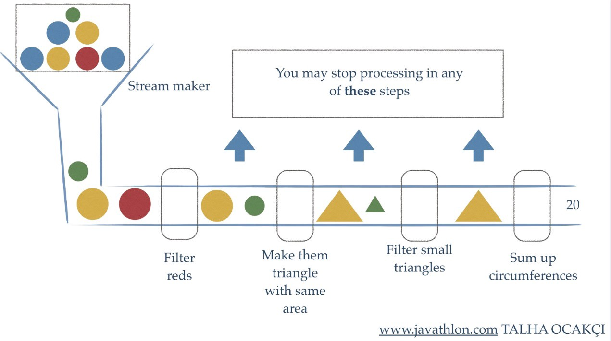

## Collections

What would you do without collections? Nearly every Java application makes and processes collections. They are fundamental to many programming tasks: they let you group and process data.

For example: 
- You might want to create a collection of banking transactions to represent a customer’s statement
- Then, you might want to process this collection to find out how much money the customer spent
- Then, the biggest purchase
- ...
  
Despite their importance, processing collections was far from trivial before Java 8.

[Source](https://www.oracle.com/technical-resources/articles/java/ma14-java-se-8-streams.html)

## Limitations of working with collections

Typical processing patterns on collections are similar to SQL-like operations:
- *Finding*: find the heaviest dog
- *Grouping*: group all dogs of a given breed
  
Most databases let you specify such operations *declaratively*

```sql
SELECT id, MAX(weight) from dogs
```

We don’t need to implement **how** to calculate the maximum weight, we only express that we want it. You worry less about how to explicitly implement such queries. Why can’t we do something similar with collections?

How many times do you find yourself re-implementing these operations using loops over and over again?

How can we process really large collections efficiently?  Ideally, to speed up the processing, you want to leverage multicore architectures. As we will learn, writing parallel code is **hard** and **error-prone**!

## Streams

The new abstraction called Stream lets you process data in a declarative way.

Streams can leverage multi-core architectures without you having to write a single line of multithread code




[Source](https://docs.oracle.com/en/java/javase/16/docs/api/java.base/java/util/stream/package-summary.html)

## Motivating example

Let us write a couple of operations on collections of the `Dog` class below:

```java
public class Dog {
  public String name;
  public int height;
  public int weight;

  public Dog(String name, int height, int weight) {
    this.name = name;
    this.height = height;
    this.weight = weight;
  }

  public String toString() {
    return String.format("(%s: %dkg, %dcm)", name, weight, height);
  }
}
```
Let us print, from a list of dogs, the tallest dog and the average weight of the dogs.

```java
public class Main {
  public static void main(String[] args) {
    Dog d1 = new Dog("Max", 50, 8);
    Dog d2 = new Dog("Marley", 60, 10);
    Dog d3 = new Dog("Rocky", 30, 5);
    Dog d4 = new Dog("Bear", 70, 12);
    Dog d5 = new Dog("Luna", 30, 13);
    Dog d6 = new Dog("Luna", 25, 10);

    List<Dog> dogs = List.of(d1, d2, d3, d4, d5, d6);
    System.out.println("Original array: " + dogs);

    Dog tallest = dogs.get(0);
    for (Dog dog : dogs) {
      if (dog.height > tallest.height) {
        tallest = dog;
      }
    }

    System.out.println("The tallest dog is: " + tallest);

    int sum = 0;
    for (Dog dog : dogs) {
      sum += dog.weight;
    }
    double averageWeight = (double) sum / dogs.size();

    System.out.println("The average weight is: " + averageWeight);
  }
}
```

This is how you would solve the same problem with Streams:

```java
public class StreamSolution1 {
  public static void main(String[] args) {
    Dog d1 = new Dog("Max", 50, 8);
    Dog d2 = new Dog("Marley", 60, 10);
    Dog d3 = new Dog("Rocky", 30, 5);
    Dog d4 = new Dog("Bear", 70, 12);
    Dog d5 = new Dog("Luna", 30, 13);
    Dog d6 = new Dog("Luna", 25, 10);

    List<Dog> dogs = List.of(d1, d2, d3, d4, d5, d6);
    System.out.println("Original array: " + dogs);

    Dog tallest = dogs.stream()
            .max(Comparator.comparing(dog -> dog.height))
            .get();

    System.out.println("The tallest dog is: " + tallest);

    double averageWeight = dogs.stream()
            .mapToInt(dog -> dog.weight)
            .average()
            .orElse(0);

    System.out.println("The average weight is: " + averageWeight);
  }
}
```

Now, let us produce a list, in alphabetical order, of the name of all dogs with are less than 60 cm tall and weigh more than 5 kg.

If we don't use streams, we could do:

```java
public class ClassicSolution2 {
  public static void main(String[] args) {
    Dog d1 = new Dog("Max", 50, 8);
    Dog d2 = new Dog("Marley", 60, 10);
    Dog d3 = new Dog("Rocky", 30, 5);
    Dog d4 = new Dog("Bear", 70, 12);
    Dog d5 = new Dog("Luna", 30, 13);
    Dog d6 = new Dog("Luna", 25, 10);

    List<Dog> dogs = List.of(d1, d2, d3, d4, d5, d6);
    System.out.println("Original array: " + dogs);

    Set<String> nameSet = new HashSet<>();

    for (Dog dog : dogs) {
      if (dog.weight > 5 && dog.height < 60) {
        nameSet.add(dog.name);
      }
    }

    List<String> nameList = new ArrayList<>(nameSet);
    nameList.sort(Comparator.naturalOrder());

    System.out.println("Dog names: " + nameList);
  }
}
```

Using streams, we could do:

```java
public class StreamSolution2 {
  public static void main(String[] args) {
    Dog d1 = new Dog("Max", 50, 8);
    Dog d2 = new Dog("Marley", 60, 10);
    Dog d3 = new Dog("Rocky", 30, 5);
    Dog d4 = new Dog("Bear", 70, 12);
    Dog d5 = new Dog("Luna", 30, 13);
    Dog d6 = new Dog("Luna", 25, 10);

    List<Dog> dogs = List.of(d1, d2, d3, d4, d5, d6);
    System.out.println("Original array: " + dogs);

    List<String> nameList =
        dogs.stream()
            .filter(dog -> dog.height < 60 && dog.weight > 5)
            .map(dog -> dog.name)
            .distinct()
            .sorted()
            .collect(Collectors.toList());

    System.out.println("Dog names: " + nameList);
  }
}
```

## Lambda expressions and streams

Using streams, we can easily **filter** elements:

```java
 Dog[] smallDogs = dogs.stream()
                      .filter(dog -> dog.height <= 50)
                      .toArray(Dog[]::new);
```

**Sort** the elements according to a given field:

```java
String[] sortedDogs = dogs.stream()
                        .sorted((o1, o2) -> o1.name.compareToIgnoreCase(o2.name))
                        .toArray(String[]::new);
```

**Map** its elements into another array:

```java
String[] dogNames = dogs.stream()
                      .map(dog -> dog.name)
                      .toArray(String[]::new);
```

**Find** an element that fits some criteria:

```java
Dog biggestDog = dogs.stream()
                    .max((o1, o2) -> o1.height - o2.height)
                    .get();
```

## Streams vs Collections

Streams differ from collections in several ways:

- **No storage**:
  - A stream is not a data structure that stores elements
  - it conveys elements from a source such as a data structure, an array, a generator function, or an I/O channel, through a pipeline of computational operations

- **Functional in nature**:
  - An operation on a stream produces a result, but does not modify its source
  - For example, filtering a Stream obtained from a collection produces a new Stream without the filtered elements, rather than removing elements from the source collection.

- **Laziness-seeking**: 
  - Many stream operations, such as filtering, mapping, or duplicate removal, can be implemented lazily, exposing opportunities for optimization. For example, "find the first String with three consecutive vowels" need not examine all the input strings. 

- **Possibly unbounded**:
  - While collections have a finite size, streams need not
  - Short-circuiting operations such as `limit(n)` or `findFirst()` can allow computations on infinite streams to complete in finite time

- **Consumable**:
  - The elements of a stream are only visited once during the life of a stream
  - Like an `Iterator`, a new stream must be generated to revisit the same elements of the source


https://docs.oracle.com/en/java/javase/16/docs/api/java.base/java/util/stream/package-summary.html