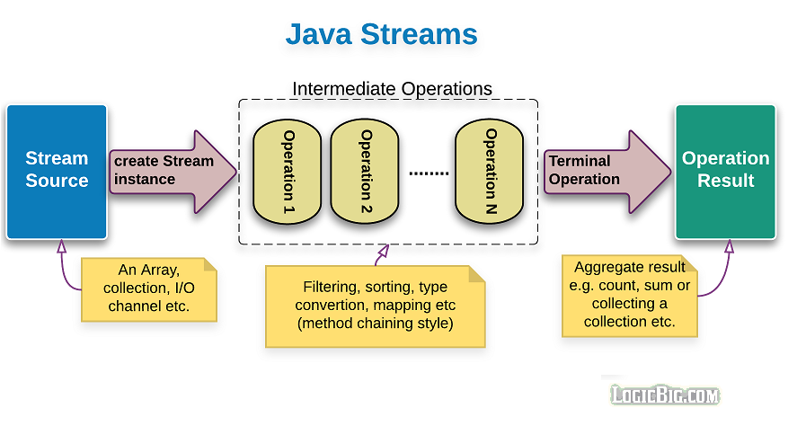
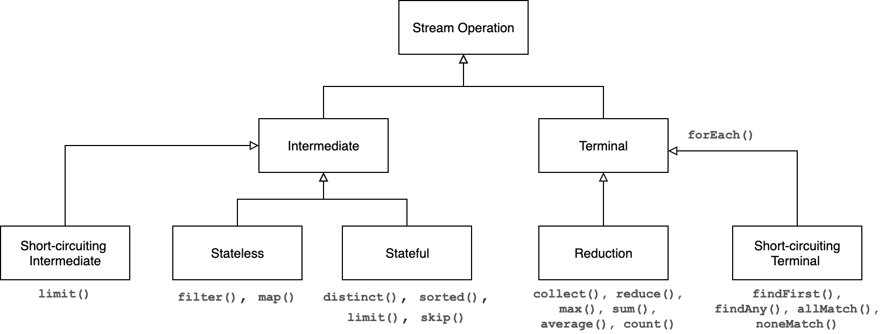
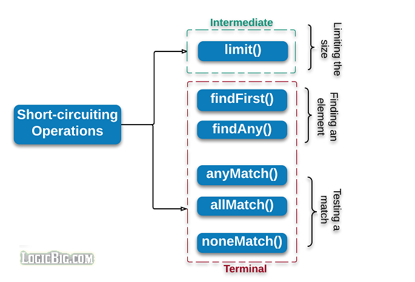

## Stream operations and pipelines

Stream operations are combined to form **stream pipelines**

A stream pipeline consists of:
One **stream source**, such as a `Collection`, a generator function, or an I/O channel
Zero or more **intermediate operations**, such as `Stream.filter` or `Stream.map`
One **terminal operation**, such as `Stream.forEach` or `Stream.reduce`

**Intermediate operations**: 
Return a new stream
Are "lazy"
E.g. `filter()`, `map()`, `sorted()`

**Terminal operations**:
Traverse the stream to produce a result or a side-effect
Are mostly "eager" 
After a terminal operation is performed, the stream pipeline is considered consumed, and can no longer be used
E.g. `forEach()`, `sum()`, `max()`


Here is our previous pipeline:

```java
public class StreamSolution2 {
  public static void main(String[] args) {
    Dog d1 = new Dog("Max", 50, 8);
    Dog d2 = new Dog("Marley", 60, 10);
    Dog d3 = new Dog("Rocky", 30, 5);
    Dog d4 = new Dog("Bear", 70, 12);
    Dog d5 = new Dog("Luna", 30, 13);
    Dog d6 = new Dog("Luna", 25, 10);

    List<Dog> dogs = List.of(d1, d2, d3, d4, d5, d6);
    System.out.println("Original array: " + dogs);

    List<String> nameList =
        dogs.stream()
            .filter(dog -> dog.height < 60 && dog.weight > 5)
            .map(dog -> dog.name)
            .distinct()
            .sorted()
            .collect(Collectors.toList());

    System.out.println("Dog names: " + nameList);
  }
}
```

## Stream pipelines




## Stream operations 



## Intermediate operations

Processing intermediate operations lazily allows for significant efficiencies:
  
It fuses multiple steps into a single pass on the data. E.g., in a filter-map-sum pipeline, filtering, mapping, and summing are done together

It avoids examining all the data when it is not necessary. E.g. To find the first string longer than 1000 characters, it is only necessary to examine strings until you find the desired one

This behavior becomes even more important when the input stream is infinite and not merely large

Intermediate operations are further divided into stateless and stateful operations

**Stateless operations**:
  - Retain no state from previously seen element when processing a new element -- each element can be processed independently of operations on other elements
  - E.g. `filter()`, `map()`

**Stateful operations**:
  - Incorporate state from previously seen elements when processing new elements
  - E.g. `distinct()`, `sorted()`
  - May need to process the entire input before producing a result

## Short-circuiting operations

A short-circuiting operations are just like boolean short-circuit evaluations in Java

**Intermediate short-circuiting operation**: 
  - it may produce a reduced stream as a result
  - E.g. `limit()`

**Terminal short-circuiting operation**: 
  - it may finish before transversing all elements in the stream
  - E.g. `findFirst()`, `findAny()`

  


[Source](https://www.logicbig.com/tutorials/core-java-tutorial/java-util-stream/short-circuiting.html)


## Reduction operations

A **reduction operation** takes a sequence of input elements and combines them into a single summary result, such as:

Finding the sum of a set of numbers 

  `[1, 2, 3, 4, 5] = 1 + 2 + 3 + 4 + 5 = 15` 
  
Finding the average of a set of numbers 

  `[1, 2, 3, 4, 5] = (1 + 2 + 3 + 4 + 5)/5 = 3` 
  
Finding the highest on a set of numbers 

  `[1, 2, 3, 4, 5] = 5` 

Accumulating elements into a list

Here is an example of a reduction to sum elements in a list:

  ```java
  int sum = 0;
  for (int x : numbers) {
      sum += x;
  }
  ```

And here is an equivalent code using streams:

  ```java
  int sum = numbers.stream().reduce(0, (x,y) -> x+y);
  ```

or:

  ```java
  int sum = numbers.stream().reduce(0, Integer::sum);
  ```

An advantage of using streams is that the solution is inherently parallelizable:

  ```java
  int sum = numbers.parallelStream().reduce(0, Integer::sum);
  ```

**Mutable reduction**: accumulates input elements into a mutable result container, such as: 
  - a **`Collection`** 
  - a **`StringBuilder`**

**Immutable reduction**: accumulates input elements into single valued immutable variable, such as:
- an **`int`**
- a **`boolean`**

The streams classes have *general* reduction operations, which repeatedly apply a combining operation
- **`reduce()`**: to perform an immutable reduction
- **`collect()`**: to perform a muttable reduction

Common reduction operations are already made for us:
- **`sum()`**
- **`max()`**
- **`count()`**

