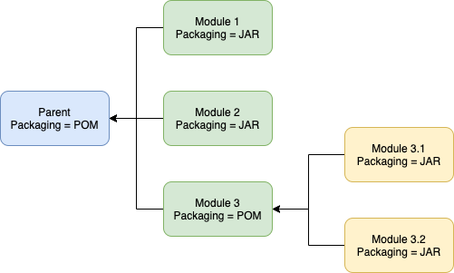

## Clean plugin

- Used to remove files generated at build-time in a project's directory.
- Goals:
  - **`clean:clean`** attempts to clean a project's working directory of the files that we're generated at build-time. By default, it discovers and deletes the directories configured in project.build.directory, project.build.outputDirectory, project.build.testOutputDirectory, and project.reporting.outputDirectory.
- Webpage: https://maven.apache.org/plugins/maven-clean-plugin/  

## Clean plugin - Example 1

The clean plugin can be configured to delete additional files and directories:

```xml
<plugin>
    <artifactId>maven-clean-plugin</artifactId>
    <version>3.1.0</version>
    <configuration>
        <filesets>
            <fileset>
                <directory>log</directory>
                <includes>
                    <include>**/*.tmp</include>
                    <include>**/*.log</include>
                </includes>
                <excludes>
                    <exclude>**/important.log</exclude>
                    <exclude>**/another-important.log</exclude>
                </excludes>
            </fileset>
            <fileset>
                <directory>${project.basedir}/delete-this-folder</directory>
                <includes>
                    <include>**</include>
                </includes>
            </fileset>
        </filesets>
    </configuration>
</plugin>
```

## Clean plugin - Example 2

We can also call the clean plugin automatically during a build:

```xml
<plugin>
  <artifactId>maven-clean-plugin</artifactId>
  <version>3.1.0</version>
  <executions>
    <execution>
      <id>auto-clean</id>
      <phase>initialize</phase>
      <goals>
        <goal>clean</goal>
      </goals>
    </execution>
  </executions>
</plugin>
```

## Compiler plugin

- Used to compile the sources of your project.
- Goals:
  - **`compiler:compile`** is bound to the compile phase and is used to compile the main source files.
  - **`compiler:testCompile`** is bound to the test-compile phase and is used to compile the test source files.
- Both goals already bound to their proper phases within the Maven Lifecycle and are, therefore, automatically executed during their respective phases.
- By default the compiler plugin will use Java version 1.6, independently of the JDK you run Maven with. **It is strongly recommended to change this setting**
- Webpage: https://maven.apache.org/plugins/maven-compiler-plugin/  

## Compiler plugin - Example

We can instruct the compiler plugin to use the Java version we want.

```xml
<project>
  [...]
  <build>
    [...]
    <plugins>
      <plugin>
        <groupId>org.apache.maven.plugins</groupId>
        <artifactId>maven-compiler-plugin</artifactId>
        <version>3.8.1</version>
        <configuration>
          <source>1.8</source>
          <target>1.8</target>
        </configuration>
      </plugin>
    <plugins>
    [...]
  </build>
  [...]
</project>
```

or 

```xml
<project>
  [...]
  <properties>
    <maven.compiler.source>1.8</maven.compiler.source>
    <maven.compiler.target>1.8</maven.compiler.target>
  </properties>
  [...]
</project>
```

## Resources plugin

- Handles the copying of project resources to the output directory
- There are two kinds of resources: 
  - main resources: associated with the main source code
  - test resources: associated with the test source code
- Goals:
  - **`resources:resources`** is bound to the process-resources phase and copies the resources for the main source code to the main output directory.
  - **`resources:testResources`** is bound to the process-test-resources phase and copies the resources for the test source code to the test output directory.
  - **`resources:copy-resources`** copies resources to an output directory. This goal requires that you configure the resources to be copied, and specify the outputDirectory.
- Webpage: https://maven.apache.org/plugins/maven-resources-plugin/  


## Resources plugin - Example

Here is an example of how to configure and call the **`copy-resources`** goal:

```xml
<project>
  <build>
    <plugins>
      <plugin>
        <artifactId>maven-resources-plugin</artifactId>
        <version>3.1.0</version>
        <executions>
          <execution>
            <id>copy-resources</id>
            <phase>generate-resources</phase>
            <goals>
              <goal>copy-resources</goal>
            </goals>
            <configuration>
              <outputDirectory>${basedir}/target/extra-resources</outputDirectory>
              <resources>          
                <resource>
                  <directory>src/non-packaged-resources</directory>
                </resource>
              </resources>              
            </configuration>            
          </execution>
        </executions>
      </plugin>
    </plugins>
  </build>
</project>
```

## Surefire plugin

- The Surefire Plugin is used during the test phase of the build lifecycle to execute the unit tests of an application.
- Goals:
  - **`surefire:test `** is bound to the test phase and runs the unit tests of an application.
-  The plugin generates reports in two different file formats:
  - Plain text files (*.txt)
  - XML files (*.xml)
- By default, these files are generated in *`${basedir}/target/surefire-reports/TEST-*.xml.`*
- Webpage: https://maven.apache.org/surefire/maven-surefire-plugin/  

## Surefire plugin - Example 1

Using the surefire plugin, we can run a single test case:

```java
import org.junit.jupiter.api.Assertions;
import org.junit.jupiter.api.Test;

public class MySecondTest {
  @Test
  void thisTestFails() {
      Assertions.assertEquals(2, 3);
  }
}
```

```bash
$ mvn -Dtest=MySecondTest test
```

We will need JUnit as a dependency:

```xml
<dependency>
    <groupId>org.junit.jupiter</groupId>
    <artifactId>junit-jupiter-api</artifactId>
    <version>5.7.0</version>
    <scope>test</scope>
</dependency>
<dependency>
    <groupId>org.junit.jupiter</groupId>
    <artifactId>junit-jupiter-engine</artifactId>
    <version>5.7.0</version>
    <scope>test</scope>
</dependency>
```

## Surefire plugin - Example 2

We can instruct Maven to ignore some test files:

```xml
<plugin>
  <groupId>org.apache.maven.plugins</groupId>
  <artifactId>maven-surefire-plugin</artifactId>
  <version>3.0.0-M4</version>
  <configuration>
    <excludes>
      <exclude>MyFourthTest</exclude>
      <exclude>*Second*</exclude>
    </excludes>
  </configuration>
</plugin>
```

We can identify specific files and folders, or define patterns to identify them.

## JaCoCo plugin

The JaCoCo plugin provides code coverage metrics for Java code via integration with JaCoCo, a code coverage library for Java.

```xml
<plugin>
    <groupId>org.jacoco</groupId>
    <artifactId>jacoco-maven-plugin</artifactId>
    <version>0.8.7</version>
    <executions>
        <execution>
            <goals>
                <goal>prepare-agent</goal>
            </goals>
        </execution>
        <execution>
            <id>report</id>
            <phase>test</phase>
            <goals>
                <goal>report</goal>
            </goals>
        </execution>
    </executions>
</plugin>
```

## Jar plugin

- Provides the capability to build jars.
- Goals:
  - **`jar:jar `** is bound to the package phase and creates a jar file for your project classes inclusive resources.
  - **`jar:test-jar `** creates a jar file for your project test classes.
- Webpage: https://maven.apache.org/plugins/maven-jar-plugin/  


## Jar plugin - Example 1

- We can customize the Manifest file generated by the plugin. In the example below, we set the **main class** and add our dependencies to the **classpath** pointing to their jars in our local maven repository.

  ```xml
  <project>
    [...]
    <build>
      <plugins>
        <plugin>
          <groupId>org.apache.maven.plugins</groupId>
          <artifactId>maven-jar-plugin</artifactId>
          <version>3.2.0</version>
          <configuration>
            <archive>
              <index>true</index>
              <manifest>
                <addClasspath>true</addClasspath>
                <classpathPrefix>${settings.localRepository}</classpathPrefix>
                <classpathLayoutType>repository</classpathLayoutType>
                <mainClass>it.unibz.inf.HelloWorld</mainClass>
              </manifest>
            </archive>
          </configuration>
        </plugin>
      </plugins>
    </build>
    [...]
  </project>
  ```

## Assembly plugin

- Allow users to aggregate the project output along with its dependencies, modules, site documentation, and other files into a single distributable archive. Currently it can create distributions in the following formats:
  - zip
  - tar
  - tar.gz (or tgz)
  - tar.bz2 (or tbz2)
  - tar.snappy
  - tar.xz (or txz)
  - jar
  - dir
  - war
- Goals:
  - **`assembly:single `** assembles an application bundle or distribution from an assembly descriptor. This goal is suitable either for binding to the lifecycle or calling directly from the command line (provided all required files are available before the build starts, or are produced by another goal specified before this one on the command line).
- Webpage: https://maven.apache.org/plugins/maven-assembly-plugin/  
- Your project can build distribution "assemblies" easily, using one of the convenient, prefabricated assembly descriptors. These descriptors handle many common operations, such as packaging a project's artifact along with generated documentation into a single zip archive. 
- Alternatively, your project can provide its own descriptor and assume a much higher level of control over how dependencies, modules, file-sets, and individual files are packaged in the assembly.
- For more sophisticated assemblies, we can use the [Maven Shade Plugin](http://maven.apache.org/plugins/maven-shade-plugin/index.html)

## Assembly plugin - Example

We can automatically create a fat-jar and a source zip (bound to the package phase):

```xml
<plugin>
  <groupId>org.apache.maven.plugins</groupId>
  <artifactId>maven-assembly-plugin</artifactId>
  <executions>
      <execution>
          <phase>package</phase>
          <goals>
              <goal>single</goal>
          </goals>
          <configuration>
              <archive>
                  <manifest>
                      <mainClass>it.unibz.inf.HelloWorld</mainClass>
                  </manifest>
              </archive>
              <descriptorRefs>
                  <descriptorRef>jar-with-dependencies</descriptorRef>
                  <descriptorRef>src</descriptorRef>
              </descriptorRefs>
          </configuration>
      </execution>
  </executions>
</plugin>
```

## Install plugin

- Used during the install phase to add artifact(s) to the local maven repository. 
- It uses the information in the POM (groupId, artifactId, version) to determine the proper location for the artifact within the local repository.
- Goals:
  - **`install:install`** is used to automatically install the project's main artifact (the JAR, WAR or EAR), its POM and any attached artifacts (sources, javadoc, etc) produced by a particular project.
  - **`install:install-file`** is mostly used to install an externally created artifact into the local repository, along with its POM. In that case, the project information can be taken from an optionally specified pomFile, but can also be given using command line parameters.
- Webpage: https://maven.apache.org/plugins/maven-install-plugin/  

## Deploy plugin

- Primarily used during the deploy phase to add your artifact(s) to a remote repository for sharing with other developers and projects. It can also be used to deploy a particular artifact.
- This is usually done in an integration or release environment. 
- Goals:
  - **`deploy:deploy`** is used to automatically install the artifact, its pom and the attached artifacts produced by a particular project. Most if not all of the information related to the deployment is stored in the project's pom.
  - **`deploy:deploy-file`** is used to install a single artifact along with its pom. In that case, the artifact information can be taken from an optionally specified pomFile, but can be completed/overriden using the command line.
- Webpage: https://maven.apache.org/plugins/maven-deploy-plugin/  


<!-- # Multi-module projects

## Overview of multi-module projects




## Overview of multi-module projects

- Each module is a Maven project:
  - Can define its java version
  - Can have its own dependencies
  - ...

- A child module inherits what is defined in the parent module
  - Much like the default properties inherited in the effective POM

- A module may have child modules, which may have child modules, which may have child modules...

## Maven Reactor

- Component responsible for building each module of a multi-module Maven project

- The Reactor:

  - Collects the models to be built
  - Determine the build order of the modules
  - Run the selected build lifecycle on all modules

- By default, the Rector runs on a single thread, i.e., build all modules sequentially. 

- It can, however, be configured to use threads to run builds in parallel (if possible!)

## Multi-module code smells

- Only use modules when needed!

- A multi-module project compiles slowly than a monolithic module

- You may be overusing modules if:

  - There is a single class or interface in a module
  - You are trying to optimize library size without an actual need

## Creating a multi-module project

- Create a folder structure as follows:

  ```output
  ├── pom.xml
  ├── submodule1
  │   ├── pom.xml
  │   └── src
  │       └── main
  │           └── java
  │               └── it
  │                   └── unibz
  │                       └── submodule1
  │                           └── Person.java
  ├── submodule2
  │   ├── pom.xml
  │   └── src
  │       └── main
  │           └── java
  │               └── it
  │                   └── unibz
  │                       └── submodule2
  │                           ├── Dog.java
  │                           └── Main2.java
  └── submodule3
      ├── pom.xml
      └── src
          └── main
              └── java
                  └── it
                      └── unibz
                          └── submodule3
                              └── Main3.java
  ```

## Creating a multi-module project - cont.

- In **submodule1**, **`Person.java`** should look like this:

  ```java
  public class Person {

    String name;

    public Person(String name) {
        this.name = name;
    }

    @Override
    public String toString() {
        return name;
    }
  }
  ```

## Creating a multi-module project - cont.

- In **submodule2**, **`Dog.java`** should look like this:

  ```java
  public class Dog {
    String breed;

    public Dog(String breed) {
        this.breed = breed;
    }

    @Override
    public String toString() {
        return breed;
    }
  }
  ```

  and **`Main2.java`** should look like this:

  ```java
  import java.util.ArrayList;
  import org.apache.commons.lang3.StringUtils;
  import it.unibz.submodule1.Person;

  public class Main2 {
    public static void main(String[] args) {
        ArrayList<Dog> dogs = new ArrayList<>();
        dogs.add(new Dog("Pitbull"));
        dogs.add(new Dog("German Shepherd"));
        System.out.println(dogs);

        ArrayList<Person> people = new ArrayList<>();
        people.add(new Person("Rick"));
        people.add(new Person("Morty"));
        people.forEach(System.out::println);

        System.out.println("Is blank?" + StringUtils.isBlank("   "));
    }
  }
  ```

## Creating a multi-module project - cont.

- In **submodule3**, **`Main3.java`** should look like this:

  ```java
  import java.util.ArrayList;
  import org.apache.commons.lang3.StringUtils;
  import it.unibz.submodule2.Dog;
  import it.unibz.submodule1.Person;

  public class Main3 {
    public static void main(String[] args) {
        ArrayList<Dog> dogs = new ArrayList<>();
        dogs.add(new Dog("Bulldog"));
        dogs.add(new Dog("Basset Hound"));
        System.out.println(dogs);

        ArrayList<Person> people = new ArrayList<>();
        people.add(new Person("Rick"));
        people.add(new Person("Morty"));
        people.forEach(System.out::println);

        System.out.println("Is blank?" + StringUtils.isBlank("   "));
    }
  }
  ```

## The parent POM

- The parent `pom.xml` defines dependencies and properties share among all modules:

  ```xml
  <project xmlns="http://maven.apache.org/POM/4.0.0" xmlns:xsi="http://www.w3.org/2001/XMLSchema-instance"
         xsi:schemaLocation="http://maven.apache.org/POM/4.0.0 http://maven.apache.org/maven-v4_0_0.xsd">
    
    <modelVersion>4.0.0</modelVersion>
    <groupId>it.unibz</groupId>
    <artifactId>parent</artifactId>
    <version>1.0-SNAPSHOT</version>
    <packaging>pom</packaging>

    <modules>
        <module>submodule1</module>
        <module>submodule2</module>
        <module>submodule3</module>
    </modules>

    <properties>
        <maven.compiler.target>1.8</maven.compiler.target>
        <maven.compiler.source>1.8</maven.compiler.source>
        <project.build.sourceEncoding>UTF-8</project.build.sourceEncoding>
    </properties>

    <dependencies>
        <dependency>
            <groupId>org.apache.commons</groupId>
            <artifactId>commons-lang3</artifactId>
            <version>3.10</version>
        </dependency>
    </dependencies>

  </project>
  ```

## Dependencies between modules

- We can resolve the dependency between modules by explicitly declaring dependencies between them:

  ```xml
  <project xmlns="http://maven.apache.org/POM/4.0.0" xmlns:xsi="http://www.w3.org/2001/XMLSchema-instance"
         xsi:schemaLocation="http://maven.apache.org/POM/4.0.0 http://maven.apache.org/maven-v4_0_0.xsd">
    <modelVersion>4.0.0</modelVersion>

    <parent>
        <groupId>it.unibz</groupId>
        <artifactId>parent</artifactId>
        <version>1.0-SNAPSHOT</version>
    </parent>

    <groupId>it.unibz</groupId>
    <artifactId>submodule2</artifactId>
    <version>1.0-SNAPSHOT</version>

    <dependencies>
        <dependency>
            <groupId>it.unibz</groupId>
            <artifactId>submodule1</artifactId>
            <version>1.0-SNAPSHOT</version>
            <scope>compile</scope>
        </dependency>
    </dependencies>

  </project>
  ```

## Dependencies between modules - cont.

```xml
<project xmlns="http://maven.apache.org/POM/4.0.0"
         xmlns:xsi="http://www.w3.org/2001/XMLSchema-instance"
         xsi:schemaLocation="http://maven.apache.org/POM/4.0.0 http://maven.apache.org/xsd/maven-4.0.0.xsd">
    <modelVersion>4.0.0</modelVersion>

    <parent>
        <groupId>it.unibz</groupId>
        <artifactId>parent</artifactId>
        <version>1.0-SNAPSHOT</version>
    </parent>

    <groupId>it.unibz</groupId>
    <artifactId>submodule3</artifactId>
    <version>1.0-SNAPSHOT</version>

    <dependencies>
        <dependency>
            <groupId>it.unibz</groupId>
            <artifactId>submodule1</artifactId>
            <version>1.0-SNAPSHOT</version>
            <scope>compile</scope>
        </dependency>
        <dependency>
            <groupId>it.unibz</groupId>
            <artifactId>submodule2</artifactId>
            <version>1.0-SNAPSHOT</version>
            <scope>compile</scope>
        </dependency>
    </dependencies>

</project>
``` -->

## Javadoc plugin

- The Javadoc Plugin uses the Javadoc tool to generate javadocs for the specified project.
- For details, refer to https://maven.apache.org/plugins/maven-javadoc-plugin/
- To start generating Javadoc HTML from you code, add this to your `pom.xml`:

  ```xml
  <plugin>
    <groupId>org.apache.maven.plugins</groupId>
    <artifactId>maven-javadoc-plugin</artifactId>
    <version>3.2.0</version>
  </plugin>
  ```

- Then, simply run:

  ```terminal
  $ mvn javadoc:javadoc
  ```