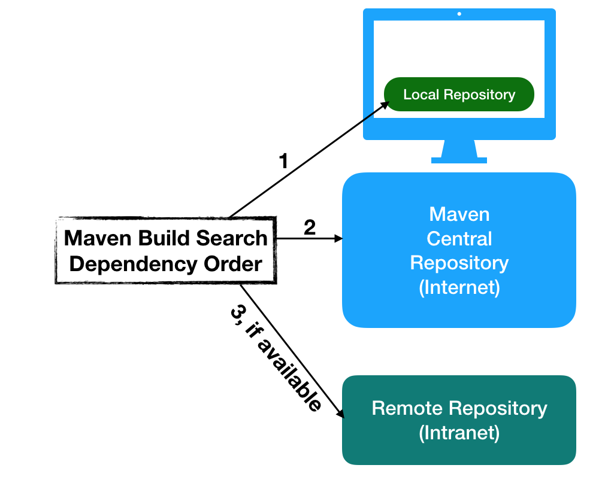

## Maven repositories

A Maven repository is a location where artifacts are stored

- **local**: the repository in your local file system

  ```terminal
  $ ls ~/.m2
  ```

- **central**: a public repository hosted by the maven community

  [https://repo1.maven.org/maven2/](https://repo1.maven.org/maven2/)

- **remote**: other repositories that could be either public or private

  - Spring plugins, WSO2 Releases, JBoss Releases
  - Companies may create their own Maven repositories

You can browse several public repositories at [https://mvnrepository.com/](https://mvnrepository.com/).

## Maven repositories



 
Diagram from [this](https://www.journaldev.com/33630/maven-repository) journaldev.com article.


## settings.xml

The `settings` element in the `settings.xml` file contains elements used to define values that configure Maven execution in various ways, like the `pom.xml`, but **should not be bundled to any specific project, or distributed to an audience**. 

These values include:
- the local repository location, 
- alternate remote repository servers, and 
- authentication information.

There are two locations where a `settings.xml` file may live:
- The Maven install (global settings): `${maven.home}/conf/settings.xml`
- A user’s install (user settings): `${user.home}/.m2/settings.xml`

If both files exist, their contents get merged, with the user-specific `settings.xml` being dominant.

Here is an overview of the top elements under settings:

  ```xml
  <settings xmlns="http://maven.apache.org/SETTINGS/1.0.0"
    xmlns:xsi="http://www.w3.org/2001/XMLSchema-instance"
    xsi:schemaLocation="http://maven.apache.org/SETTINGS/1.0.0
                        https://maven.apache.org/xsd/settings-1.0.0.xsd">
    <localRepository/>
    <interactiveMode/>
    <offline/>
    <pluginGroups/>
    <servers/>
    <mirrors/>
    <proxies/>
    <profiles/>
    <activeProfiles/>
  </settings>
  ```

Read more at https://maven.apache.org/settings.html.

## Changing the local repository's location

This is not something we often want to do, but we can change the location of our local repository by customizing the `settings.xml` file:

```xml
<settings xmlns="http://maven.apache.org/SETTINGS/1.0.0"
        xmlns:xsi="http://www.w3.org/2001/XMLSchema-instance"
        xsi:schemaLocation="http://maven.apache.org/SETTINGS/1.0.0 http://maven.apache.org/xsd/settings-1.0.0.xsd">
  
  <localRepository>${user.home}/my-alternative-repository</localRepository>

</settings>
```
