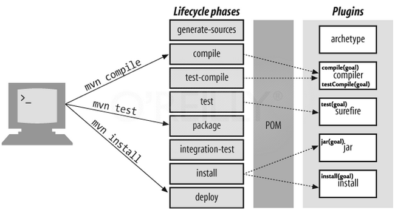

## Maven build lifecycles

Maven is build around the concepts of build **Lifecycles**, **Phases**, **Plugins** and **Goals**.

A **lifecycle** is an abstract concept around the expected stages in a project’s development lifetime. 
It is a sequence of named stages i.e **phases**.

Maven has three defined Lifecycles:
- clean: cleans the project environment
- default (build): builds and deploys the project
- site: creates a website for the project

**Phases** are the steps in a lifecycle which gets executed sequentially. 
- Executing a phase means executing all the previous phases. 
- Each phase may or may not perform some operations.
- Maven defines 28 phases: 
  - the default lifecycle has 21 phases
  - the clean lifecycle has 3
  - the site lifecycle has 4 phases

A **plugin** is a collection of **goals**, which are specific tasks contributing to building and managing projects. One can think of plugins as classes and goals as methods.


Figure from [this](https://medium.com/@anandmattikopp/maven-lifecycle-phases-plugins-and-goals-25d8e33fa22) medium.com article.


## The clean lifecycle

```xml
<phases>
  <phase>pre-clean</phase>
  <phase>clean</phase>
  <phase>post-clean</phase>
</phases>
<default-phases>
  <clean>
    org.apache.maven.plugins:maven-clean-plugin:2.5:clean
  </clean>
</default-phases>
```


http://maven.apache.org/ref/3.6.3/maven-core/lifecycles.html#clean_Lifecycle  


## The default lifecycle

- **validate**: check if all information necessary for the build is available
- **compile**: compile the source code
- **test-compile**: compile the test source code
- **test**: run unit tests
- **package**: package compiled source code into the distributable format (e.g. `.jar`)
- **integration-test**: process and deploy the package if needed to run integration tests
- **install**: install the package to a local repository
- **deploy**: copy the package to the remote repository





 
Figure from [this](https://www.bogotobogo.com/Java/tutorials/Maven/Apache-Maven-Lifecycle.php) article.

Plugin bindings for `jar` packaging:

```xml
<phases>
  <process-resources>
    org.apache.maven.plugins:maven-resources-plugin:2.6:resources
  </process-resources>
  <compile>
    org.apache.maven.plugins:maven-compiler-plugin:3.1:compile
  </compile>
  <process-test-resources>
    org.apache.maven.plugins:maven-resources-plugin:2.6:testResources
  </process-test-resources>
  <test-compile>
    org.apache.maven.plugins:maven-compiler-plugin:3.1:testCompile
  </test-compile>
  <test>
    org.apache.maven.plugins:maven-surefire-plugin:2.12.4:test
  </test>
  <package>
    org.apache.maven.plugins:maven-jar-plugin:2.4:jar
  </package>
  <install>
    org.apache.maven.plugins:maven-install-plugin:2.4:install
  </install>
  <deploy>
    org.apache.maven.plugins:maven-deploy-plugin:2.7:deploy
  </deploy>
</phases>
```

Read more [here](http://maven.apache.org/ref/3.6.3/maven-core/default-bindings.html).
 

## The site lifecycle

```xml
<phases>
  <phase>pre-site</phase>
  <phase>site</phase>
  <phase>post-site</phase>
  <phase>site-deploy</phase>
</phases>
<default-phases>
  <site>
    org.apache.maven.plugins:maven-site-plugin:3.3:site
  </site>
  <site-deploy>
    org.apache.maven.plugins:maven-site-plugin:3.3:deploy
  </site-deploy>
</default-phases>
```

Read more [here](http://maven.apache.org/ref/3.6.3/maven-core/lifecycles.html#site_Lifecycle).


