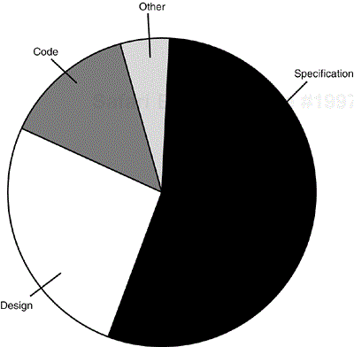
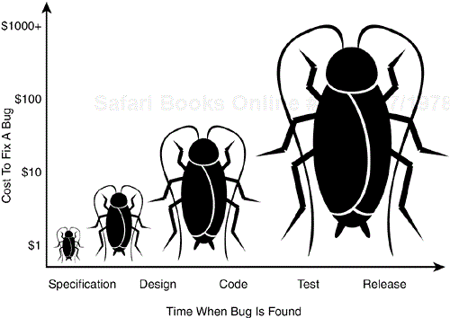

In god we trust, everything else we test.

## Reference Book

[Java Unit Testing with JUnit 5: Test Driven Development with JUnit 5](https://ubz-primo.hosted.exlibrisgroup.com/permalink/f/pok0fm/39UBZ_ALMA_DS51259912950001241)

## The purpose of tests

Why do we test our software?

1. Software systems are pervasive in our lives. Even small bugs have relevant impacts.
2. Software is often used in mission critical scenarios where failure is unacceptable.
3. Software defects cost money!
    - To the users
    - To the developers
4. We want to confidently release a new version of our software.
5. We want to document how our system should behave.

## Testing terminology

**Product specification**: an agreement among the software development team that defines the product they are creating, detailing what it will be, how it will act, what it will do, and what it won't do.

**Bug**: 
- A software problem 
- A deviation from the *product specification*
- Also known as defect, fault, error, problem, anomaly...
- May be big or small, intended or unintended

For the purposes of this course, a software bug occurs when:

1. The software doesn't do something that the *product specification* says it should do.
2. The software does something that the *product specification* says it shouldn't do.
3. The software does something that the *product specification* doesn't mention.
4. The software doesn't do something that the *product specification* doesn't mention but should.
5. The software is difficult to understand, hard to use, slow, or—in the software tester's eyes—will be viewed by the end user as just plain not right.

*From: Ron Patton, **[Software Testing, Second Edition](https://ubz-primo.hosted.exlibrisgroup.com/permalink/f/tb3h4b/39UBZ_ALMA_DS51185118610001241)** (2005). Sams Publishing.*

## A bug example

Let us exemplify bugs using a calculator:

- **Specification**:
  - The calculator should perform correct addition, subtraction, multiplication, and division operations
  - The calculator should not crash if multiple buttons are pressed simultaneously

- **Bugs**: 
  - If you press + and nothing happens, that's a bug because of (1)
  - If you press 2 and 3 at the same time and the calculator stops responding (2)
  - The calculator does square root (3)
  - The calculator gives wrong results when the battery is low (4)
  - The buttons are too small (5)

## Why do bugs occur?

Here is the result of a an assessment of bug causes:

Most bugs can be traced to the **product specification**:
- It is not written
- It is poorly written
- It keeps changing
- It is not properly communicated

Another relevant portion can be attributed to design:
- It is not well thought out
- It is rushed
- It is poorly communicated 
- It keeps changing

The third main category is only traceable to code:
- Complex software
- Schedule pressure
- Plain dumb mistakes
- Poor documentation

## The cost of bugs

The costs of fixing bugs grow logarithmically with time:

## Testing
	
**Definition:** The activity to verify if a (or a portion of a) software behaves according to its specification

Types of testing:
- By approach: 
  - white-box x black-box
  - static x dynamic
- By level: 
  - unit x integration x system x acceptance
- By aspect:
  - functional x non-functional
  - performance
  - usability
  - security
- By automation:
  - automated x manual

## Unit tests

A **unit test** is:
- Automated
- Designed to verify a small piece of code
- Fast
- Isolated
- Typically white-box

A **small piece of code** usually refers to a method or a class.

**Fast is subjective**, but you should aim for a test suite that runs in a few seconds.

Unit tests themselves should be run in isolation from each other, so that you run tests in parallel, sequentially, or in any order.

Unit tests are not suitable for testing complex user interface or component interaction.

*From: Vladimir Khorikov, **Unit Testing Principles, Practices, and Patterns** (2020). Manning Publications. Unit Testing Principles, Practices, and Patterns*

##  Benefits of unit testing

- **Determines specifications**: Before we start the journey of coding a component we must try to determine what the component must do? Try to build a test case of the possible inputs and the possible outputs. The act of building test cases at the start helps to clarify the expected behavior of the component.

  If we are unable to come up with a test, it means that the specifications are not explicit enough and require more thinking.

- **Early error detection**: Unit tests are proof of working code. They are executed in every build and can detect failures at the first instance.

  Unit tests can detect not only coding bugs but flaws in product specifications as well. A unit test demonstrates progress; thus, as soon as a component is complete, it can be demo-ed to the stakeholders to find gaps, if any. The sooner a bug is uncovered, the cheaper it is to fix.

- **Supports maintenance**: Product specifications evolve over time. These changes lead to development cycles. In each of these cycles, the team has to understand how the existing code works before team members can make any changes. Unit tests help in understanding the intended behavior without being bogged down by the actual code. A well-written unit test suite serves as a productivity boost for the team.

- **Improves design**: Unit tests are the first client of the code being tested. They uncover various issues that a client can face while interfacing with the code being tested. Unit tests make us think in terms of the expected input and the expected output. For internal components (service, utilities, etc.), this can help in classifying responsibility boundaries. It helps in improving product specifications by exposing gaps in the interface design.

- **Product documentation**: Unit tests describe how a piece of code works—that is, the expected output for a given input. They always describe the latest state of a specification, as they are kept in sync with the code changes.

## Test coverage

The percentage of code which is tested by unit tests.

Criteria:
- Statement
- Branch
- Function
- Line

It helps you to identify which portions of your code have been tested
  - 100% test coverage is unrealistic
  - Test coverage is not the whole picture...

## Testing frameworks

There are several testing frameworks available for Java, the most popular ones being:

- [JUnit 4](https://junit.org/junit4/)
- [JUnit 5](https://junit.org/junit5/)
- [TestNG](https://testng.org)
- [Spock](https://spockframework.org/)
- [JBehave](https://jbehave.org/)

In this course, we will use **JUnit 5**. 
