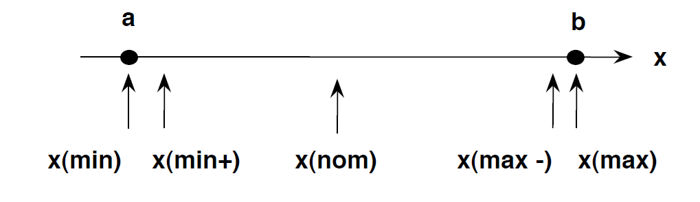

In this section, we will discuss the **Right-BICEP** acronym, as proposed by Jeff Langr, Andy Hunt, and Dave Thomas, in **[Pragmatic Unit Testing in Java 8 with JUnit](https://ubz-primo.hosted.exlibrisgroup.com/permalink/f/pok0fm/39UBZ_ALMA_DS51260958870001241)**, 2015. 


Just as important as knowing how to write tests, is knowing which tests to write.

Your Right-BICEP provides you with the strength needed to ask the right questions about what to test:
- **Right**: Are the results right?
- **B**: Are all the boundary conditions correct?
- **I**: Can you check inverse relationships?
- **C**: Can you cross-check results using other means?
- **E**: Can you force error conditions to happen?
- **P**: Are performance characteristics within bounds?

## [Right]-BICEP: Are the Results Right?

You should first and foremost validate that your code produces the expected results.

Write tests for happy-paths: *"If the code ran correctly, how would I know?"*

If you don’t know how to write a test around the happy path for a small bit of code, you probably do not fully understand what it is you’re trying to build.

### What if my requirements are vague or incomplete?

Nothing stops you from proceeding without answers to every last question, but you need to make decisions anyway.

The unit tests you write document your choices.
  
When change comes, you will at least know how the current code behaves.

### Exercise

Write unit tests for our `Calculator` class checking some happy paths.

Happy paths for the `divide(int numerator, int denominator)` method:
  - 4 divided by 2
  - 7 divided by 3 
  - -10 divided by -2
  - -50 divided by 10

## Right-[B]ICEP: Boundary Conditions

Happy paths may not hit any boundary conditions in the code.

**Boundary condition**: a scenario that involves the edges of the input domain.

Boundary conditions you might want to think about include:
  - Bogus or inconsistent input values, such as a filename of "!*W:X\&Gi/w$→>$g/h#WQ@.
  - Badly formatted data, such as an email address missing a top-level domain (fred@foobar.)
  - Computations that can result in numeric overflow
  - Empty or missing values, such as 0, 0.0, "", or null
  - Values over reasonable expectations, such as a person’s age of 150 years
  - Duplicates in lists that shouldn’t have duplicates, such as a roster of students in a classroom
  - Ordered lists that aren’t, and vice versa
  - Try handing a presorted list to a sort algorithm, for instance—or even a reverse-sorted list.



Minimum
Just above the minimum
A nominal value
Just below the maximum
Maximum

### Exercise

Write unit tests for our `Calculator` class checking some boundary cases.

Boundary cases for the `divide(int numerator, int denominator)` method:
- 0 divided by a non-zero number
- 0 times a non-zero number
- 1 times N should be equal to N
- Numerator/denominator equal to 2147483647 (Highest value of int)
- Numerator/denominator equal to -2147483648 (Lowest value of int)
  

## Right-B[I]CEP: Checking Inverse Relationships

Sometimes you’ll be able to check behavior by applying its logical inverse:
  - $(\sqrt{2})^2 = 2$
  - $(10/2) \times 2 = 10$
  - Adding an element to a list and then removing it yields the original list

### Exercise

Write unit tests to our `Calculator` class checking some inverse relationships:
- Division and multiplication
- Sum and subtraction


## Right-BI[C]EP: Cross-Checking Using Other Means

Any interesting problem usually has several solutions.

You choose a blue-ribbon winner, perhaps because it performs or smells better. 

That leaves the "loser" solutions available for cross-checking the production results. 

Maybe the runners-up are too slow or inflexible for production use, but they can help cross-check your winning choice, particularly if they’re trusted and true.

## Exercise

Write unit tests to our `Calculator` class cross-checking some operations:
- Multiplication in terms of addition: `5 * 3 = 5 + 5 + 5`
- Potency in terms of multiplication: `2^4 = 2 * 2 * 2 * 2`

## Right-BIC[E]P: Forcing Error Conditions

The existence of a happy path suggests that there must be an unhappy path. 

You should write tests that force errors to occur, such as:
- Passing invalid parameters
- Forcing exceptions to be thrown
- Simulating environmental situations that can break your program:
  - Network availability and errors
  - Running out of disk space
  - Running out of memory
  - Issues with wall-clock time
  - System load
  - Very high or very low video resolution

Good unit testing isn’t simply exhaustive coverage of the obvious logic paths through your code. It’s also an endeavor that requires you to pull a little creativity out of your rear pocket from time to time.

## Exercise 

Write unit tests to our `Calculator` class that forces some error conditions
- A non-zero number divided by zero 
- Zero divided by zero
- Numerator/denominator higher than 2147483647 (Highest value of int)
- Numerator/denominator lower than -2147483648 (Lowest value of int)

## Right-BICE[P]: Performance Characteristics

[Rob Pike](https://en.wikipedia.org/wiki/Rob_Pike): 
> "Bottlenecks occur in surprising places, so don’t try to second guess and put in a speed hack until you have proven that’s where the bottleneck is." 


[Donald Knuth](https://en.wikipedia.org/wiki/Donald_Knuth): 
> "Premature optimization is the root of all evil"

[Willian A. Wulf](https://en.wikipedia.org/wiki/William_Wulf)
> "More computing sins are committed in the name of efficiency (without necessarily achieving it) than for any other single reason - including blind stupidity"

If performance is a concern, you may want to write specific tests for it:
  
  ```java
  @Test
  void divideTest() {
    long start = System.nanoTime();
    int quotient = Calculator.divide(6, 1);
    long end = System.nanoTime();
    long elapsedTime = end - start;

    assertTrue(elapsedTime < 1000000000, "Expected " + elapsedTime + " to be less than 1 second");
  }
  ```

A few cautions are called for:
- You typically want to run the chunk of code a good number of times to shake out any issues around timing and the clock cycle
- A performance test is very slow compared to the bulk of your tests:
  - Run them separately from your fast unit tests
  - You don’t want to find out too long after someone introduces crummy code that doesn’t perform acceptably
  - You will not need to run them as often
- Even on the same machine, execution times can vary wildly depending on factor outside of your control, such as load on the system
- Several values may seem arbitrary

If performance is a key consideration for you, you may want to use specific tools for the job:
- [JMeter](https://jmeter.apache.org/)
- [JProfiler](https://www.ej-technologies.com/products/jprofiler/overview.html)
- [XRebel/JRebel](https://www.jrebel.com/)
