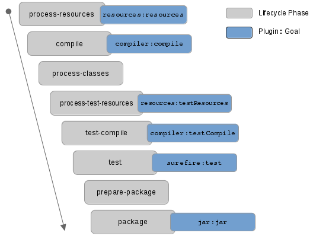

 
[JUnit 5](https://junit.org/junit5/)


## Setting up Maven

```xml
<dependencies>
    <dependency>
        <groupId>org.junit.jupiter</groupId>
        <artifactId>junit-jupiter-api</artifactId>
        <version>5.7.1</version>
        <scope>test</scope>
    </dependency>
    <dependency>
        <groupId>org.junit.jupiter</groupId>
        <artifactId>junit-jupiter-engine</artifactId>
        <version>5.7.1</version>
        <scope>test</scope>
    </dependency>
</dependencies>

<build>
    <plugins>
        <plugin>
            <artifactId>maven-surefire-plugin</artifactId>
            <version>3.0.0-M5</version>
        </plugin>
    </plugins>
</build>
```

## Creating your first test

Consider the following class:

```java
public class Calculator {

   public static int sum(int value1, int value2) {
      return value1 + value2;
   }

   public static int multiply(int value1, int value2) {
      return value1 * value2;
   }

}
```

We can test it using this class:

```java
import org.junit.jupiter.api.Test;
import static org.junit.jupiter.api.Assertions.assertEquals;

class CalculatorTest {
  @Test
  void sum() {
    int result = Calculator.sum(1, 1);
    assertEquals(2, result);
  }

  @Test
  void sumNegative() {
    int result = Calculator.sum(-1, -1);
    assertEquals(-2, result);
  }

  @Test
  void multiply() {
    int result = Calculator.multiply(1, 1);
    assertEquals(1, result);
  }
}
```

## Running your tests with your IDE

Most IDEs will provide support for you to run your tests through them:
- [Testing Java with IntelliJ IDEA](https://www.jetbrains.com/help/idea/tests-in-ide.html)
- [Testing Java with Visual Studio Code](https://code.visualstudio.com/docs/java/java-testing)
- [Testing Java with Eclipse](https://wiki.eclipse.org/Eclipse/Testing)

## Running your tests with Maven

In a Maven project, we can run tests by invoking the command below, which will trigger Maven to execute the **default lifecycle** all the way up to the **Test phase**.
  


If you execute on the root folder of your project:

```output
$ mvn test
```

You should see something like this: 

```output
[INFO] Scanning for projects...
[INFO] 
[INFO] ------------------------< it.unibz.inf:testing >------------------------
[INFO] Building testing 1.0-SNAPSHOT
[INFO] --------------------------------[ jar ]---------------------------------
[INFO] 
[INFO] --- maven-resources-plugin:2.6:resources (default-resources) @ testing ---
[INFO] Using 'UTF-8' encoding to copy filtered resources.
[INFO] Copying 0 resource
[INFO] 
[INFO] --- maven-compiler-plugin:3.8.1:compile (default-compile) @ testing ---
[INFO] Changes detected - recompiling the module!
[INFO] Compiling 1 source file to /Users/tpsales/Documents/GitHub/sources/lecture_notes/...
[INFO] 
[INFO] --- maven-resources-plugin:2.6:testResources (default-testResources) @ testing ---
[INFO] Using 'UTF-8' encoding to copy filtered resources.
[INFO] skip non existing resourceDirectory /Users/tpsales/Documents/GitHub/sources/lecture_notes/...
[INFO] 
[INFO] --- maven-compiler-plugin:3.8.1:testCompile (default-testCompile) @ testing ---
[INFO] Changes detected - recompiling the module!
[INFO] Compiling 1 source file to /Users/tpsales/Documents/GitHub/sources/lecture_notes/20_testing/...
[INFO]
[INFO] --- maven-surefire-plugin:2.22.2:test (default-test) @ testing ---
[INFO] 
[INFO] -------------------------------------------------------
[INFO]  T E S T S
[INFO] -------------------------------------------------------
[INFO] Running it.unibz.inf.CalculatorTest
[INFO] Tests run: 2, Failures: 0, Errors: 0, Skipped: 0, Time elapsed: 0.055 s - in it.unibz.inf.CalculatorTest
[INFO] 
[INFO] Results:
[INFO] 
[INFO] Tests run: 2, Failures: 0, Errors: 0, Skipped: 0
[INFO] 
[INFO] ------------------------------------------------------------------------
[INFO] BUILD SUCCESS
[INFO] ------------------------------------------------------------------------
[INFO] Total time:  2.984 s
[INFO] Finished at: 2020-05-13T18:12:04+02:00
[INFO] ------------------------------------------------------------------------
```

To run all *tests within a class*, do:

```output
$ mvn -Dtest=CalculatorTest test
```

To run a *single test*, do:

```output
$ mvn -Dtest=CalculatorTest#sum test
```

To run *tests that match a pattern*, do:

```output
$ mvn -Dtest=CalculatorTest#sum* test
```


