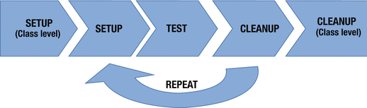

 
## Lifecycle Phases

A typical JUnit test class has multiple test cases, each of which is governed by a test lifecycle.

A cycle consists of the following three phases:

1. **Setup phase**, when the test infrastructure is put in place:
    - One part is done once before all tests within a class are executed 
    - One part is done before each test method is executed the test level
2. **Execution phase**, when the test methods are executed and their assertions are verified
    - The execution result will signify a success or failure.
3. **Cleanup phase**, when any cleanup required after test execution is performed. Just like the class-level setup, there is a class-level cleanup also, which can be used to dispose of all the singletons created at the class level.
  



## `@BeforeAll`

The `org.junit.jupiter.api.BeforeAll` annotation is responsible for performing a single time initialization for all test cases in a class. 

The annotated method must be **static** and **non-private**. 

This hook is often used to create costly objects like database connection, which can be reused for all the test cases. 

The work done in a `@BeforeAll` can be moved to `@BeforeEach`, but since it is usually a computationally expensive operation, the overall test execution can take much longer.

The annotation also has an inherited behavior. If there are superclass methods marked with @BeforeAll they will be executed before any such methods of the test class.

Here is an example on how to use `@BeforeAll`:

```java
public class CalculatorBeforeAll {
   private static int inputValue;

   @BeforeAll
   static void beforeAll() {
      System.out.println("I have been executed once before all methods");
      inputValue = 10;
   }

   @Test
   void positiveMultiplication() {
      System.out.println("Value available in positiveMultiplication(): " + inputValue);
      int value = Calculator.multiply(inputValue, 20);
      assertTrue(value > 0);
   }

   @Test
   void negativeMultiplication() {
      System.out.println("Value available in negativeMultiplication(): " + inputValue);
      int value = Calculator.multiply(-inputValue, -4);
      assertTrue(value > 0);
   }
}
```

## `@BeforeEach`

The `org.junit.jupiter.api.BeforeEach` annotation is responsible for performing any initialization before executing a single test.

The objects will be created for each test, thus **avoiding any side effects from other test executions**.

A test case can have any number of methods marked with `@BeforeEach` but the execution order is not guaranteed. 
The JUnit engine can run them in any order. 

These methods are executed before each and every test; so always make sure they **contain initialization code that makes sense for all test cases**.

Here is an example on how to use `@BeforeEach`:

```java
class CalculatorBeforeEach {
   private int inputValue;

   @BeforeEach
   void setUp() {
      System.out.println("I execute before each test method");
      inputValue = 10;
   }

   @Test
   void positiveMultiplication() {
      System.out.println("Value available in positiveMultiplication(): " + inputValue);
      int value = Calculator.multiply(inputValue, 20);
      assertTrue(value > 0);

      inputValue = 500;
   }

   @Test
   void negativeMultiplication() {
      System.out.println("Value available in negativeMultiplication(): " + inputValue);
      int value = Calculator.multiply(-inputValue, -4);
      assertTrue(value > 0);

      inputValue = 500;
   }
}
```


## Avoid dependent tests

It is a good idea to **keep tests independent**. 
- Dependent tests make a test suite harder to read and understand. 
- In the event of a failure, dependent tests are harder to debug. 

Imagine the following case: 
- `testA` depends on `testB`, which depends on `testC`
- if `testA` fails we need to expend effort to determine if all of the previous test cases executed fine and properly initialized the test setup. 
  
This is an unwanted **Test Smell**.


## `@AfterEach`

The `org.junit.jupiter.api.AfterEach` annotation is the counterpart of the `org.junit.jupiter.api.BeforeEach` annotation.

It is used to implement the “what goes up must come down” principle. 

A method marked with `@AfterEach` is responsible for post-test execution cleanup. 


```java
public class CalculatorLifeCycle {
   @AfterEach
   void tearDown() {
      System.out.println("I execute after each test method");
   }

   @Test
   void positiveMultiplication() {
      System.out.println("I execute test positiveMultiplication()");
      assertTrue(Calculator.multiply(10, 20) > 0);
   }

   @Test
   void negativeMultiplication() {
      System.out.println("I execute test negativeMultiplication()");
      assertTrue(Calculator.multiply(-5, -4) > 0);
   }
}
```


## `@AfterAll`

The `org.junit.jupiter.api.AfterAll` annotation is the counterpart of the `org.junit.jupiter.api.BeforeAll` annotation. 

`@AfterAll` performs a single time method invocation (i.e., post the execution of all test cases of a test class). 

The method must be **static** and **non-private**. 

The annotation also has an inherited behavior. If there are superclass methods marked with @AfterAll they will be executed after any such methods of the test class.


```java
public class CalculatorLifeCycle {
   @AfterAll
   static void afterAll(){
      System.out.println("I execute once after all test methods");
   }

   @Test
   void positiveMultiplication() {
      System.out.println("I execute test positiveMultiplication()");
      assertTrue(Calculator.multiply(10, 20) > 0);
   }

   @Test
   void negativeMultiplication() {
      System.out.println("I execute test negativeMultiplication()");
      assertTrue(Calculator.multiply(-5, -4) > 0);
   }
}
```

## Complete example

Here is an example using all lifecycle hooks:

```java
public class CalculatorLifeCycle {
   @BeforeAll
   static void beforeAll(){
      System.out.println("I execute once before all test methods");
   }

   @BeforeEach
   void setUp() {
      System.out.println("I execute before each test method");
   }

   @AfterEach
   void tearDown() {
      System.out.println("I execute after each test method");
   }

   @AfterAll
   static void afterAll(){
      System.out.println("I execute once after all test methods");
   }

   @Test
   void positiveMultiplication() {
      System.out.println("I execute test positiveMultiplication()");
      assertTrue(Calculator.multiply(10, 20) > 0);
   }

   @Test
   void negativeMultiplication() {
      System.out.println("I execute test negativeMultiplication()");
      assertTrue(Calculator.multiply(-5, -4) > 0);
   }
}
```

## Exercise

You were tasked to write tests for the `ArrayList` class. 

1. Create a test class called `ArrayListTest` and use a `@BeforeEach` annotation to create an empty list to test the behavior of the methods `add()` and `remove()`.
1. Create a test class called `ArrayListTestAdd` and use a `@BeforeAll` annotation to set up a list which you will then use verify the expected behavior of `size()` and `get()`.


