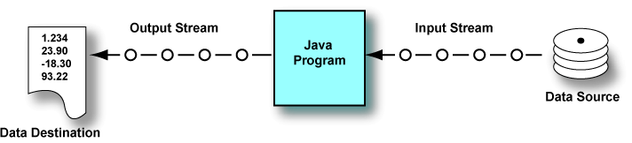
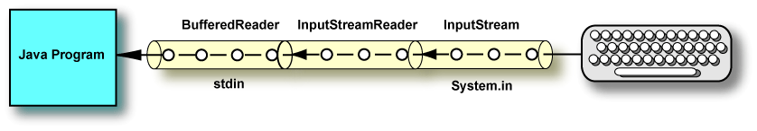
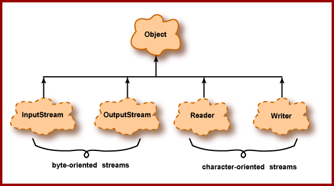
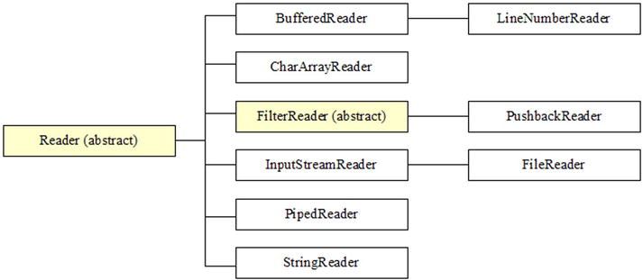
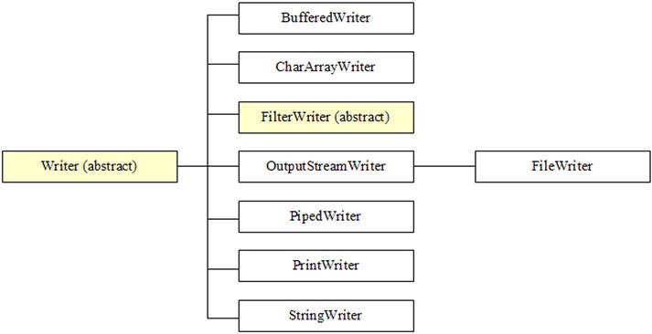
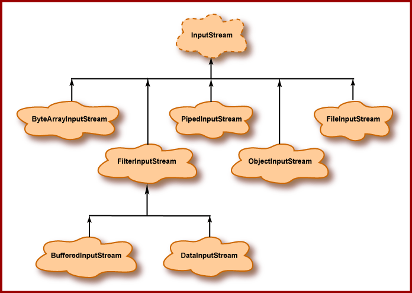

We have seen how to manipulate files as a whole, now let's see how to manipulate their content!

## `java.io`

We will start by discussing input and output (I/O) using the `java.io` package. 
- I/O is done using streams. 
- A stream is a sequence of data flowing from a source to a destination. 
- I/O streams can be connected to a wide variety of data sources and destinations. 



## Input and output streams

- Data for a program may come from several sources. 
- Data created by a program may be sent to several destinations. 
- The connection between a program and a data source or destination is called a **stream.**

- An **input stream** handles data flowing into a program. 
- An **output stream** handles data flowing out of a program.

- In the picture, each "O" is a piece of data. The data are streaming from the source into the program. Computed results are streaming from the program to the destination.


## I/O devices

- There are many types of I/O devices. 
- Some can be a source, others can be a destination, and others can be both source and destination. 
- Often the destination for one stream is the source for another. 
- Some objects switch roles depending on what program is running. 
- For example a disk file might be the destination for the output of one program, and later it may be the source for another program.

- Here are some examples:

| Object              | Source, Destination or Both? |
|---------------------|-------------------------------|
| disk file           |              Both             |
| running program     |              Both             |
| monitor             |              Destination      |
| keyboard            |              Source           |
| Internet connection |              Both             |
| image scanner       |              Source           |

## Types of Streams

A stream object may be:

- An input stream or an output stream
- A processing stream or an ordinary stream
- A character-oriented stream or a byte-oriented stream
- May be connected to a variety of sources or destinations

- There are many types of streams
- For example, a stream might be an 
	- "input, character-oriented, processing stream"
	- "byte-oriented output stream"
- Not only are there many types of streams, there are also many ways to combine them
- The I/O aspects of a program can get complicated

## Processing Streams



- A processing stream operates on the data supplied by another stream. 
- Often a processing stream acts as a buffer for the data coming from another stream. 
- A buffer is a block of main memory used as a work area. 
- For example, disks usually deliver data in blocks of 512 bytes, no matter how few bytes a program has asked for. 
- Usually the blocks of data are buffered and delivered from the buffer to the program in the amount the program asked for.

- In the picture, 
	- the keyboard sends data to the InputStream System.in which 
	- is connected to a InputStreamReader stream which 
	- is connected to a BufferedReader stream. 
- System.in is a stream object that the Java system automatically creates when your program starts running.


## Processing Streams


- The data are transformed along the way. 
- The raw bytes from the keyboard are grouped together into a String object that the program reads using stdin.readLine().
- A program can set all this up by declaring a BufferedReader as follows:

```java
BufferedReader stdin = 
  new BufferedReader( 
    new  InputStreamReader( System.in ) );
```

- This may seem like an unnecessary complication. 
- But java.io gives you a collection of parts that can be assembled to do nearly any I/O task you need.

## Character Streams and Byte Streams

- **Character streams are intended exclusively for character data.**
- **Byte streams are intended for general purpose input and output.**

- Of course, fundamentally all data consist of patterns of bits grouped into 8-bit bytes. 
- So, logically all streams could be called "byte streams". 
- However, streams that are intended for bytes that represent characters are called **character streams** and all others are called **byte streams**

- Character streams are optimized for character data and perform some other useful character-oriented tasks (more on this later). 
- Often the source or destination of a character stream is a text file, a file that contains bytes that represent characters.

- data sources and destinations often contain non-character data. 
- For example, the bytecode file created by the Java compiler contains machine instructions for the Java virtual machine. 
- These are not intended to represent characters, and input and output of them must use byte streams.

## I/O Class Hierarchy


{width=70%}


- The diagram shows the top of the hierarchy for the java.io package. 
- The dotted clouds are abstract classes. 
- They act as base classes for specialized streams (to be discussed shortly).

## I/O Class Hierarchy

{width=70%}

- Streams are byte-oriented or character-oriented. Each type has input streams and output streams.
- Byte-oriented streams.
	- Intended for general-purpose input and output.
    - Data may be primitive data types or raw bytes.
- Character-oriented streams.
	- Intended for character data.
	- Data is transformed from/to 16 bit Java char used inside programs to the format used externally.


## Readers and Writers

- Readers and Writers deal with character streams. 
- These are abstract classes. 
- A program must use classes derived from them. 
	- For example, a BufferedReader is a Reader.

- Character streams are optimized for handling character data. 
- They also translate between the internal format used by Java programs and an external format used for text files. 
- Inside a Java program character data is represented with the 16-bit char data type. 
- The characters of a String also use this 16-bit code. 
- On a disk file, characters are by default represented in  UTF8.


## Readers

{width=70%}

- Reader is an abstract class from which all character-oriented input streams are derived. 
- These streams deliver **16-bit char data to a program**. 
- The source of the data may be in a variety of formats (such as UTF format on a disk file). 
- The diagram shows several Reader classes.
- All these classes are character-oriented input streams. 
- Only a few classes are discussed here, mostly FileReader.

## Writer

{width=70%}

- Writer, an abstract class from which all character-oriented output streams are derived. 
- All these streams are aimed at **receiving 16-bit char data from a program**, and sending it to another destination, which may use a different character format (such as UTF format on a disk file).
- All these classes are character-oriented output streams. 
- We will be especially interested in FileWriter and PrintWriter classes.


## InputStream

{width=60%}

\footnotesize

- InputStream is an abstract class from which all byte-oriented input streams are derived. 
- Its descendant classes are used for general-purpose input (non-character input). 
- These streams deliver **data to a program in groups of 8-bit bytes**. 
- The bytes can be grouped into the size necessary for the type of data.
- For example, if a disk file contains 32-bit int data, data can be delivered to the program in 4-byte groups in the same format as Java primitive type int.
- We will be mostly concerned with DataInputStream and FileInputStream.


## OutputStream

{width=60%}

\footnotesize

- OutputStream is an abstract class from which all byte-oriented output streams are derived. 
- Its descendant classes are used for general-purpose (non-character output). 
- These streams are aimed at **writing groups of 8-bit bytes to output destinations**. 
- The bytes are in the same format as Java primitive types. 
- For example, 4-byte groups corresponding to type int can be written to a disk file.
- We will mostly be interested in FileOutputStream and DataOutputStream. 
- We have used PrintStream many times already, because System.out is an object of that type.

## Object Streams

- You may have noticed the class **ObjectOutputStream** in the previous diagram. 
- Streams of that class write objects to a destination such as a disk file. 
- **ObjectInputStream** streams read objects from a source. 
- So far in our programs objects have existed only in main memory and lasted only as long the program that created them was running. When the program stopped running (or earlier), they were garbage collected.
- With an ObjectOutputStream an object can be written to disk and will remain there even after the program stops. This is the topic of **object serialization** 

## I/O Class Hierarchy wrap up

{width=70%}

- Streams are byte-oriented or character-oriented. Each type has input streams and output streams.
- Byte-oriented streams.
	- Intended for general-purpose input and output.
    - Data may be primitive data types or raw bytes.
- Character-oriented streams.
	- Intended for character data.
	- Data is transformed from/to 16 bit Java char used inside programs to the UTF format used externally.
