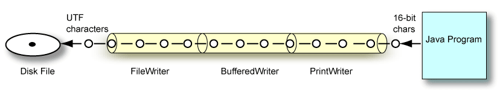

In Java, you can write data into a file in multiple ways:
  - Using a `FileWriter` object
  - Using a `BufferedWriter` object
  - Using a `PrintWriter` object
  - Using the `Files` class

Let us see discover these alternatives by writing an array of names into a file: 
  
```java
String[] names = {"Rick", "Morty", "Birdperson", "Beth", "Summer", "Jerry", "Mr. Meeseeks"};
```

## Using a FileWriter

```java
public class WriteToFileUsingFileWriter {
  public static void main(String[] args) {
    File file = new File("src/main/resources/filewriter-write-names.txt");
    writeNames(file);
    writeNames(file);
    writeNames(file);
  }

  // Writes, line by line, an array of names to a file using {@link FileWriter}
  private static void writeNames(File file) {
    String[] names = {"Rick", "Morty", "Birdperson", "Beth", "Summer", "Jerry", "Mr. Meeseeks"};

    try (FileWriter writer = new FileWriter(file)) {
      for (String name : names) {
        writer.append(name)
              .append(System.lineSeparator());
      }
      writer.write("---");

    } catch (IOException e) {
      e.printStackTrace();
    }
  }
}
```

## New lines

As in our example, we often need to add new lines to a file.

In a `FileWriter`, that can be achieved through the statements below:

  ```java
  writer.write("\n");		// Mac/Linux: LF
  writer.write("\r\n");	// Win: CR + LF

  fw.write(System.lineSeparator()); // OS-independent solution
  ```

## Using a FileWriter: Appending to the file

```java
public class AppendToFileUsingFileWritter {
  public static void main(String[] args) {
    File file = new File("src/main/resources/filewriter-append-names.txt");
    appendNames(file);
    appendNames(file);
  }

  // Appends, line by line, an array of names to a file using a FileWriter
  private static void appendNames(File file) {
    String[] names = {"Gearhead", "Squanchy", "Unity", "Tammy", "Jessica", "Mr. Goldenfold"};

    // The boolean parameter in the constructor opens the file in "append-mode" 
    try (FileWriter writer = new FileWriter(file, true)) {
      for (String name : names) {
        writer.append(name).append(System.lineSeparator());
      }
      writer.write("---" + System.lineSeparator());

    } catch (IOException e) {
      e.printStackTrace();
    }
  }
}
```

## Using a BufferedWriter

```java
public class WriteToFileUsingBufferedWriter {
  // Writes, line by line, an array of names to a file using BufferedWriter
  public static void main(String[] args) {
    File file = new File("src/main/resources/bufferedwriter-write-names.txt");
    String[] names = {"Rick", "Morty", "Birdperson", "Beth", "Summer", "Jerry", "Mr. Meeseeks"};

    try (BufferedWriter writer = new BufferedWriter(new FileWriter(file))) {
      for (String name : names) {
        writer.write(name);
        // We now have a dedicated method for adding a new line
        writer.newLine();
      }
      writer.write("---");
      writer.newLine();

    } catch (IOException e) {
      e.printStackTrace();
    }
  }
}
```


## PrintWriter



A more convenient writer:
- Allows us to abstract away from how OS handle new lines
- Provides methods for formatted printing: `print()`, `println()`, `printf()`
- Provides an autoflush option
- Its methods do not throw exceptions

Often a `PrintWriter` stream is connected to a `BufferedWriter` stream which is connected to a `FileWriter`.

## Using a PrintWriter

```java
public class WriteToFileUsingBufferedWriter {
  // Writes, line by line, an array of names to a file using a PrintWriter
  public static void main(String[] args) {
    String[] names = {"Rick", "Morty", "Birdperson", "Beth", "Summer", "Jerry", "Mr. Meeseeks"};

    try (PrintWriter writer = new PrintWriter("src/main/resources/printwriter-write-names.txt")) {
      for (String name : names) {
        writer.println(name);
      }
      writer.println("---");

    } catch (IOException e) {
      e.printStackTrace();
    }
  }
}
```

## Comparing Writers

```java
public class WriterComparison {
   public static void main(String[] args) throws IOException {
      Writer writer = new FileWriter("resources/test.txt");
      writer.write("Hello\n");
      char[] chars = { 'H','e','l','l','o',' ','2','\n'};
      writer.write(chars);
      writer.write("Hello 3\n",1,7);
      writer.append("Hello 4\n");

      // Extends OutputStreamWriter, which extends Writer, and adds getEnconding()
      FileWriter fileWriter = (FileWriter) writer;
      System.out.println("File encoding: "+fileWriter.getEncoding());
      fileWriter.write("Hello 5\n");
      fileWriter.append("Hello 6\n");

      // Extends Writer; adds newLine()
      BufferedWriter bufferedWriter = new BufferedWriter(fileWriter);
      bufferedWriter.write("Hello 7");
      bufferedWriter.newLine();

      // Extends Writer; adds print(), println(), printf(), and checkError() methods
      PrintWriter printWriter = new PrintWriter(bufferedWriter);

      printWriter.print("Hello 8\n");
      printWriter.println("Hello 9");
      printWriter.printf("Hello %d %n",10);
      System.out.printf("Check error: %b", printWriter.checkError());

      printWriter.close();;
   }
}

```

## Using Files: Writing lines

```java
public class WriteLinesToFileUsingFiles {
  // Writes a collection of lines to a file using the static method write()
  public static void main(String[] args) {
    Collection<String> lines = List.of("Rick", "Morty", "Birdperson", "Beth", "Summer", "Jerry");
    Path path = Path.of("src/main/resources/files-write-names.txt");

    try {
      Files.write(path, lines, StandardOpenOption.WRITE);
    } catch (IOException e) {
      e.printStackTrace();
    }
  }
}
```

## Using Files: Writing a string

```java
public class WriteStringToFileUsingFiles {
  // Writes a collection of lines to a file using the static method writeString()
  public static void main(String[] args) {
    String[] names = {"Rick", "Morty", "Birdperson", "Beth", "Summer", "Jerry"};
    String content = String.join(System.lineSeparator(), names) + System.lineSeparator() + "---";
    Path path = Path.of("src/main/resources/files-write-names.txt");

    try {
      Files.writeString(path, content);
    } catch (IOException e) {
      e.printStackTrace();
    }
  }
}
```

## Using Files: Appending a string

```java
public class AppendStringToFileUsingFiles {
  // Appends a string to a file using the static method writeString()
  public static void main(String[] args) {
    String[] names = {"Rick", "Morty", "Birdperson", "Beth", "Summer", "Jerry"};
    String content =
            String.join(System.lineSeparator(), names)
                    + System.lineSeparator()
                    + "---"
                    + System.lineSeparator();
    Path path = Path.of("src/main/resources/files-append-names.txt");

    try {
      Files.writeString(path, content, CREATE, APPEND);
    } catch (IOException e) {
      e.printStackTrace();
    }
  }
}
```

## Exercise 4

Let us go back to our athlete exercise.

Evolve your program such that it also writes athlete data into files.

The output format should be the same as the one used in the `athlete.data` file:

```output
SWIMMER|id=1234;name=Michael;age=35;injured=false;modality=freestyle
RUNNER|id=1235;name=Usain;age=30;injured=false;shoes=Nike
```

Adjust your `Main` class as shown below:

```java
public class Main {

  public static void main(String[] args) {
    String currentFilename = "src/main/resources/athletes.data";
    List<Athlete> athletes = readAthletesFromFile(currentFilename);
    System.out.println("File read.");
    System.out.println(athletes);

    Swimmer s1 = new Swimmer("1234", "Michael", 35, false, "freestyle");
    Runner r1 = new Runner("1235", "Usain", 30, false, "Nike");

    String newFilename = "src/main/resources/new-athletes.data";
    boolean didWrite = writeAthletesToFile(newFilename, List.of(s1, r1));
    System.out.println("File " + (didWrite ? "written." : "NOT written."));
  }

  public static List<Athlete> readAthletesFromFile(String filename) { /* ... */ }

  public static boolean writeAthletesToFile(String filename, List<Athlete> athletes) {
    // WRITE YOUR CODE HERE
  }

}
    
```

<!-- ## Solution

```java
public abstract class Athlete {
  // previous methods...

  public String toDataString() {
    return String.format("id=%s;name=%s;age=%d;injured=%b", id, name, age, injured);
  }
}
```

```java
public class Runner extends Athlete {
  // previous methods...

  @Override
  public String toDataString() {
    return String.format("RUNNER|%s;shoes=%s", super.toDataString(), shoes);
  }
}
```

```java
public class Swimmer extends Athlete {
  // previous methods...

  @Override
  public String toDataString() {
    return String.format("SWIMMER|%s;modality=%s", super.toDataString(), modality);
  }
}
```

## Solution

```java
public class Main {
  public static void main(String[] args) {
    String currentFilename = "src/main/resources/athletes.data";
    List<Athlete> athletes = readAthletesFromFile(currentFilename);
    System.out.println("File read.");
    athletes.stream()
            .map(Athlete::toDataString)
            .forEach(System.out::println);

    Swimmer s1 = new Swimmer("1234", "Michael", 35, false, "freestyle");
    Runner r1 = new Runner("1235", "Usain", 30, false, "Nike");

    String newFilename = "src/main/resources/new-athletes.data";
    boolean didWrite = writeAthletesToFile(newFilename, List.of(s1, r1));
    System.out.println("File " + (didWrite ? "written." : "NOT written."));
  }

  public static boolean writeAthletesToFile(String filename, List<Athlete> athletes) {
    Path path = Path.of(filename);

    String content = athletes.stream()
            .map(Athlete::toDataString)
            .collect(joining(System.lineSeparator()));

    try {
      Files.writeString(path, content);
      return true;
    } catch (IOException e) {
      e.printStackTrace();
      return false;
    }
  }
}
``` -->