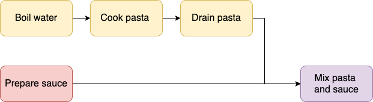
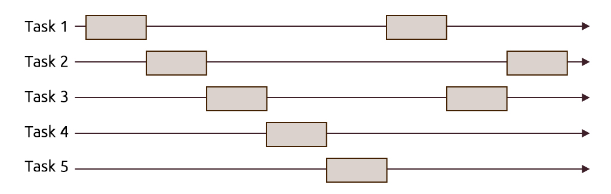
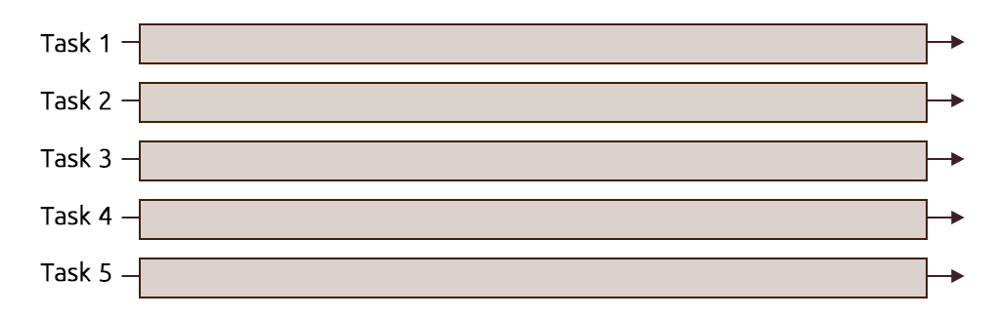

## Book

Brian Goetz, Tim Peierls, Joshua Bloch, Joseph Bowbeer, David Holmes, Doug Lea. **Java Concurrency in Practice**, 2006, Addison-Wesley Professional, ISBN 0321349601.

Read it at [O'Reilly](https://ubz-primo.hosted.exlibrisgroup.com/permalink/f/pok0fm/39UBZ_ALMA_DS51259889720001241)

[](https://ubz-primo.hosted.exlibrisgroup.com/permalink/f/pok0fm/39UBZ_ALMA_DS51259889720001241)

## Concurrency

We often need to run several programs at the same time:
- streaming a video on Chrome
- coding on IntelliJ
- video conferencing on Teams
- synching your files on the cloud with Dropbox
- reading a pdf on Acrobat
- and many more!

Have you ever wondered how that works?

## How do you make pasta?

Sequentially?


Concurrently?



## Scheduling: Sequential vs Concurrent

**Sequential scheduling**:
- **Dependent computations** that must be executed in an **specific order** to produce correct results
- Up to now, all the programs we developed in this course worked in a sequential way

**Concurrent scheduling**:
- **Independent computations** that can be executed in an **arbitrary order** with the same outcome
- A computation can advance without waiting for all other computations to complete
- A computation can be constrained by depending on interaction between computations
- *Minimizing dependencies while preserving correctness is the central problem*.
- Concurrent programming means factoring a program into independent modules or units of concurrency. 
- Units of concurrency: 
  - tasks, 
  - processes, 
  - threads, 
  - actors...

Definitions from [https://slikts.github.io/concurrency-glossary](https://slikts.github.io/concurrency-glossary).

## Execution: Serial vs Parallel

**Serial execution**:
- Executing computations one-at-a-time
- Concurrent processes can be executed on one core:
  - Enables *pseudo parallelism*
  - by interleaving the execution steps of each process via time-sharing slices
  - **only one process runs at a time**, and if it does not complete during its time slice, it is **paused**, another process **begins or resumes**, and then later the original process is resumed. 
  - multiple processes are part-way through execution at a single instant, but only one process is being executed at that instant

**Parallel execution**: 
- Executing multiple computations at the same physical instant
- Concurrent processes can be executed in multiple cores:
  - Enables *true parallelism*
  - on separate processors of a multi-processor machine, with the goal of speeding up computations

Definitions from [https://slikts.github.io/concurrency-glossary](https://slikts.github.io/concurrency-glossary)

## Concurrency

**Pseudo parallelism**: concurrent scheduling and serial execution:



**True parallelism**: concurrent scheduling and parallel execution:




## Concurrency

- Task scheduling: concurrent vs sequential
- Task execution: parallel vs serial
- Example: cooking pasta, 2 tasks scheduled concurrently
  - boiling pasta
  - preparing sauce 
- Example: consider tasks T1 and T2
  - T1 must be executed before T2 (sequential and serial)
  - T1 can be executed before T2 or vice versa (concurrent and serial)
  - T1 and T2 are executed simultaneously (concurrent and parallel)

## Concurrency level

Concurrency can take place on many levels:
- low-level hardware on a single chip
- **operating system**
  - process
  - thread
- worldwide networks

## Shared resources

The main challenge in concurrent programming is concurrency control:
- ensuring correct **communication between concurrent executions**
- coordinating access to **resources shared** among concurrent executions

Here is an example of a bug caused by an improper handling of a shared resource
- We have two threads.
- Each thread executes one line, pauses, and the other thread resumes.

```java
boolean withdraw(int withdrawal) {
  if (balance >= withdrawal) {
    balance -= withdrawal;
    return true;
  } 

  return false;
}
```

Thread 1:

```output
balance = 500
step 1: withdraw(300)
step 3: true (line 2)
step 5: balance = 200 (line 3)
```

Thread 2:

```output
balance = 500
step 2: withdraw(350)
step 4: true (line 2)
step 6: balance = -150 (line 3)
```

Thread 2 actually bypassed the if statement that prevent overdrafting the account. To prevent the occurrence of such an issue, we need to coordinate the execution of these threads!

