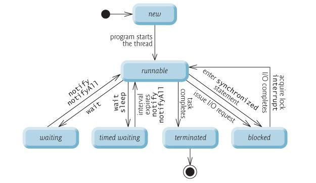

On the OS level there are two most common **units of execution**:
- processes
- threads

## Process

A process has a self-contained execution environment. In particular, **it has its own memory space**!

It takes longer to set up and it is usually a synonym for program/application.

Processes can communicate via Inter Process Communication (IPC) protocols supported by the OS:
- pipes
- sockets

The JVM is, in general, a single process.

## Thread

We can understand a thread as a "lightweight process".

Threads exist within a process and every process has at least one thread.

**Threads share the process's resources, including memory and open files**. Because of that, creating a new thread requires fewer resources than creating a new process.

In Java, a program starts with a single thread, **the main thread**, but can create new ones.

## Thread states

In Java, the life cycle of a thread is controlled by the JVM:

- **New**: a thread which has not yet started
- **Runnable**: a thread which is executing in the Java virtual machine but may be waiting for other resources from the operating system
- **Blocked**: a thread which is waiting for a monitor lock to (re)enter a synchronized block/method
- **Waiting**: a thread which is waiting for another thread to perform a particular action
- **Timed Waiting**: a thread which is waiting for a specified amount of time 
- **Terminated**: a thread which has completed execution.

## Thread types

It is important that we distinguish between two thread types:

**User threads**
- High-priority threads
- The JVM will wait for any user thread to complete its task before terminating it
- E.g. Main thread

**Daemon threads**: 
- Low-priority threads
- The JVM will terminate all daemon threads when all user threads terminate
- Their only role is to provide services to user threads
- E.g. Garbage collector 
