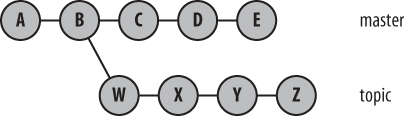
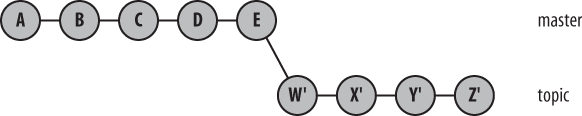

## Branches

- A branch is the fundamental means of launching a separate line of development within a software project
- A branch is a split from line of development, which allows it to continue in multiple directions simultaneously and, potentially, to produce different versions of a project
- Branches are often reconciled and merged with other branches to reunite disparate efforts
- Git allows many branches within a repository
- Git users make routine use of branches


## Why should we use branches?

- **A branch often represents an individual customer release**. If you want to start version 1.1 of your project but you know that some of your customers want to stick with version 1.0, keep the old version alive as a separate branch.
- **A branch can encapsulate a development phase**, such as the prototype, beta, stable, or bleeding-edge release. You can think of the version “1.1” release as a separate phase, too—the maintenance release.
- **A branch can isolate the development of a single feature** or research into a particularly complex bug. For example, you can introduce a branch for a well-defined and conceptually isolated task or to facilitate a merge of several branches prior to a release. It may seem like overkill to create a new branch just to fix one bug, but Git’s branching system encourages such small-scale use.
- **An individual branch can represent the work of an individual contributor**. Another branch—the “integration” branch—can be used specifically to unify efforts.


## Creating branches using `git branch`

To create a branch, run:

```command-line
$ git branch development
```

To create a branch from a particular commit, run:

```command-line
$ git branch development 56befbfbd06788dad7107cac7046b2e95b768ee2
```

The last option is the commit hash code from which to branch.

## Listing and selecting branches

To list all branches, run:

```command-line
$ git branch
```

To select a branch to work with, run:

```command-line
$ git checkout development
```

To create and checkout a branch, run:

```command-line
$ git checkout -b feature1
```

Note that `git checkout` may also be used to revert changes on a file to the last committed changes.

## What if...

1. What if I have **untracked changes** in my active branch while trying to checkout another branch?

   A may have created a new file...

   ```command-line
   $ git checkout development
   $ printf "I will not stage this new file" > unstagedFile.txt
   $ git checkout master
   ```

   Or edited an existing file.

   ```command-line
   $ git checkout development
   $ printf "I will not stage this change" > trackedFile.txt
   $ git checkout master
   ```

   Untracked changes are **brought to the checked out branch**.

2. What if I have **staged changes** in my active branch while trying to checkout another branch?

   ```command-line
   $ git checkout development
   $ printf "I will not stage this change" > file.txt
   $ git add file.txt
   $ git checkout master
   ```

   Staged changes are **brought to the checked out branch ONLY if they do not cause conflict**.

   Otherwise, you will see a message like this:

   ```command-line
   $ git checkout development

     error: Your local changes to the following files would be overwritten by checkout:
             file.txt
     Please commit your changes or stash them before you switch branches.
     Aborting
   ```

3. What if I have **committed** changes in my active branch while trying to checkout another branch?

   ```command-line
   $ git checkout development
   $ printf "I will not stage this change" > stagedFile.txt
   $ git add stagedFile.txt
   $ git checkout master
   ```

   Committed changes **stay in the original branch**

## How to inspect what is going on?

To see the content of the file that is causing the conflict:

```command-line
$ cat file.txt
```

To compare the content of the files:

```command-linen
$ git diff file.txt
```

To see the content of the file in another branch:

```command-linen
$ git show dev:file.txt
```

## Deleting branches with `git branch`

To delete a branch, run:

```command-line
$ git branch -d development
```

If the branch you are trying to delete is currently checked out, you the command will fail:

```command-line
$ git branch -d development
  error: Cannot delete branch 'development' checked out at '~/repos/file_state_repo'
```

Git will also "complain" if the branch to be deleted has changes that have not been merged into the current branch:

```command-line
$ git checkout master
  Switched to branch 'master'

$ git branch -d development
  error: The branch 'development' is not fully merged.
  If you are sure you want to delete it, run 'git branch -D development'.
```

To delete the branch anyway, run:

```command-line
$ git branch -D development
```

## Merging branches

- Git is a **distributed version control system**: It allows developers to make and record changes independently, and combine their changes at any time—all without a central repository

- A merge unifies two or more commit history branches

- A merge must occur within a single repository

- When modifications in one branch do not conflict with modifications found in another branch, Git computes a merge result and creates a new commit that represents the new, unified state.

- When branches conflict, which occurs whenever changes compete to alter the same line of the same file, Git does not resolve the dispute.

## Merging branches with `git merge`

To merge branch `source` into branch `target`, you must:

```command-line
$ git checkout target
$ git merge source
```

## Visualizing branches

Let's open the [Visualizing Git App](http://git-school.github.io/visualizing-git) and play with branches.

## Exercise

1. Initialize a repository
2. Create two branches
3. Add different files to both
4. Merge one into the other
5. Delete the merged branch

## Solution

1. Initializing the repository:
   ```command-line
   $ mkdir my_repo
   $ cd my_repo
   $ git init
   $ touch readme.md
   $ git add .
   $ git commit -m "First commit"
   ```
2. Creating two branches, `b1` and `b2`
   ```command-line
   $ git branch b1
   $ git branch b2
   ```
3. Adding different files to each branch:
   ```command-line
   $ git checkout b1
   $ printf ".DS_Store" > .gitignore
   $ git add .
   $ git commit -m "Add basic .gitignore"
   $ git checkout b2
   $ printf "Hello" > README.md
   $ git add .
   $ git commit -m "Add README.md"
   ```
4. Merging `b2` into `b1`:
   ```command-line
   $ git checkout b1
   $ git merge b2
   ```
5. Deleting branch `b2`:
   ```command-line
   $ git branch -d b1
   ```

## Merging with conflicts

Consider the following case. What will happen when the last command is invoked?

```command-line
$ git init
$ touch readme.md
$ git add .
$ git commit -m "First commit"

$ git branch dev

$ printf "# My title" > readme.md
$ git add .
$ git commit -m "Added title"

$ git checkout dev
$ printf "# A much better title\n\n ## With a header below it" > readme.md
$ git add .
$ git commit -m "Added a nice title and header"

$ git checkout master
$ git merge dev
```

To find the conflicting files, run:

```command-line
$ git status
```

What happens inside a conflicting file?

```diff
<<<<<<< HEAD
This is a nice project!
=======

# This is a better title!

## And I'll throw in a header

> > > > > > > dev
```

We should manually assess the conflicts and change the files.

Then stage and commit the changes:

```command-line
$ git add readme.md
$ git commit -m "Merged 'dev'"
```

## Rebasing commits with `git rebase`

Consider the following situation:



How do I get the C, D, and E into my `topic` branch?

I can rebase these commits and get the following situation:



By running the commands:

```command-line
$ git checkout topic
$ git rebase master
```

or:

```command-line
$ git rebase master topic
```

## `git merge` vs `git rebase`

Merge preserves history whereas rebase rewrites it.


Figure from [hackernoon.com](https://hackernoon.com/git-merge-vs-rebase-whats-the-diff-76413c117333)
