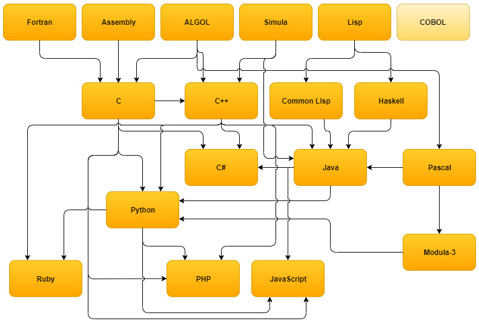
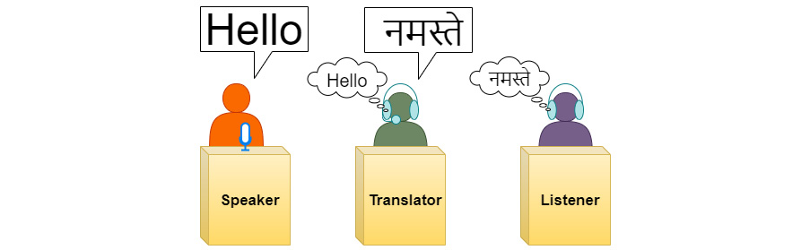
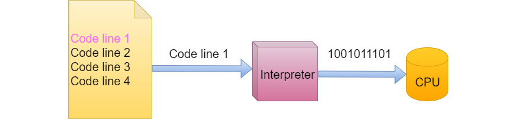
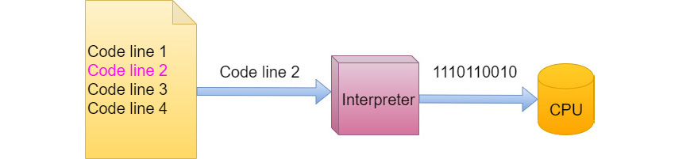
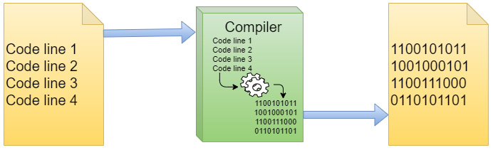
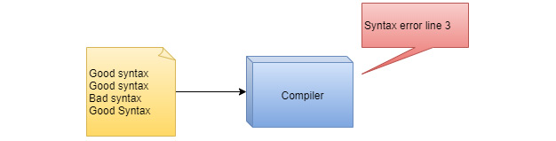

## Learning goals

In this module, you will learn:

1. asd
2. asd
3. asd

## Sources

The material in this module has been adapted from:

1. Joakim Wassberg. [Computer Programming for Absolute Beginners](https://ubz-primo.hosted.exlibrisgroup.com/permalink/f/pok0fm/39UBZ_ALMA_DS51260017570001241).

   [](https://ubz-primo.hosted.exlibrisgroup.com/permalink/f/pok0fm/39UBZ_ALMA_DS51260017570001241)

2. Oracle. [The Java™ Tutorials](https://docs.oracle.com/javase/tutorial/java/nutsandbolts/variables.html)

   [](https://docs.oracle.com/javase/tutorial/java/nutsandbolts/variables.html)

## Programming languages

Programmers write instructions in various programming languages, some directly understandable by computers and others requiring intermediate translation steps.

Hundreds of programming languages are in use today.

Check out [this](https://en.wikipedia.org/wiki/List_of_programming_languages) Wikipedia entry!

These may be divided into three general types:

1. [Machine languages](https://en.wikipedia.org/wiki/Machine_code)
2. [Assembly languages](https://en.wikipedia.org/wiki/Assembly_language)
3. [High-level programming languages](https://en.wikipedia.org/wiki/High-level_programming_language)

## Machine languages

[Machine languages](https://en.wikipedia.org/wiki/Machine_code), often called **machine code** are extremely low level programming languages that are **extremely cumbersome** for humans.

Any computer (any CPU, to be more exact) can **only directly understand its own machine language**, defined by its hardware design.

Machine languages generally consist of numbers (ultimately reduced to 1s and 0s) that instruct computers to perform their most elementary operations one at a time.

Machine languages are machine/processor dependent (a particular machine language can be used on only one type of computer).

Each computer/processor has only a (VERY) limited instruction set (i.e. number of operations):

- logic/arithmetic operations
- bit manipulation
- jump

Examples:

- Load a value into register 8, taken from the memory cell located 68 cells after the location listed in register 3:

  ```txt
  [  op  |  rs |  rt | address/immediate]
    35     3     8           68           decimal
  100011 00011 01000 00000 00001 000100   binary
  ```

- Jump to the address 1024:

  ```txt
  [  op  |        target address        ]
      2                 1024               decimal
  000010 00000 00000 00000 10000 000000   binary
  ```

## Assembly languages

[Assembly languages](https://en.wikipedia.org/wiki/Assembly_language) are low-level programming languages.

Because machine language is **too slow** and **tedious** for most programmers, instead of using the strings of numbers that computers could directly understand, programmers began using English-like abbreviations to represent elementary operations.

These abbreviations formed the basis of assembly languages.

Translator programs called **assemblers** were developed to convert assembly-language programs to machine language.

Example: how to instruct the processor to move 97 into the register AL:

- In machine code (binary): `10110000 01100001`
- In machine code (hex): `B0 61`
- In assembly: `MOV AL, 61h`

Here is a simple program. Can you guess what it does?

```assembly
.data
  msgEqual db "Equal","$"
  msgNotEqual  db "Not Equal","$"
.code
main proc
  mov bl,"Alice"
  mov bh,"Bob"
  cmp bh,bl
  jne NotEqual
  mov ax, seg msgEqual
  mov ds, ax
  mov ah, 09h
  lea dx, msgEqual
  int 21h
  mov ah, 4Ch
  int 21h
NotEqual:
  mov ax, seg msgNotEqual
  mov ds, ax
  mov ah, 09h
  lea dx, msgNotEqual
  int 21h
  mov ah, 4Ch
  int 21h
main endp
end main
```

Here is an equivalent program in Java.

```java
if ("Allice".equals("Bob"))
  System.out.println("Equal");
else
  System.out.println("Not Equal");
```

It is a lot easier to write and to understand, wouldn't you say?

## The problem with machine languages

Low-level languages are perfect for computers, but we need something more comfortable to read, write, and understand.

The **time** it takes to write a program, find bugs in our code, and update a program to add new features **costs money**.

If the language we use can help us do these tasks faster, it will **reduce costs**.

One goal of a programming language is that it must **help us be efficient** when we write programs.

## High-level programming languages

With the advent of assembly languages, computer usage increased rapidly, but programmers still had to use numerous instructions to accomplish even the simplest tasks.

To speed the programming process, high-level languages were developed in which single statements could be written to accomplish substantial tasks.

High-level languages allow you to write instructions that look almost like everyday English and contain commonly used mathematical notations.

Examples:

- Java
- Python
- C
- C++
- C#
- Javascript
- Haskell

These languages influenced one another over the years, some becoming more popular than others.



If you are curious about how used are programming languages, the [Stack Overflow Developer Survey 2021](https://insights.stackoverflow.com/survey/2021#most-popular-technologies-language) is a good source of information.

Let's take a look?

[](https://insights.stackoverflow.com/survey/2021#most-popular-technologies-language)

## Translating high-level code

To execute programs written in high-level programming languages, we need to translate them to machine languages so our computers will understand them.

There are two main ways in which this can be done:

- Compilation
- Interpretation

## Interpreting

One way to carry out this translation is by using an [interpreter](<https://en.wikipedia.org/wiki/Interpreter_(computing)>).

An interpreter will:

- look at a single line of source code,
- translate it into machine code,
- let the computer execute this line, and then
- move on to the next line of code

The way the interpreter works is a bit like how a simultaneous translator works with human languages.



Here is a simplified depiction of the interpretation process:





When working with a interpreted language, you may run into syntactical errors while running your program.


Examples of interpreted languages include:

- Javascript
- PHP
- Ruby

## Compiling

Another way to carry out the translation is by using a technique called compiling.

When we compile source code into machine code, we:

- translate every line of code,
- execute the machine code

We can compare this to the concept of translating a book:


Here is a simplified depiction of the compilation process:



When working with a compiled language, you will not be able to run your program if you have syntactical errors.



Examples of compiled languages include:

- C
- C++
- Haskell

## Interpretation vs Compilation

**Interpretation:**

- Pros:
  - Yields smaller program size
  - Portability: with the code and an interpreter, we can run it on any platform (e.g. Windows, Linux, macOS)
  - Tend to be more flexible for programmers to use
- Cons:
  - Program runs slower
  - Requires an interpreter to run
  - User has access to the source code

**Compilation:**

- Pros:
  - Runs faster
  - No extra program is needed to run
  - Tends to be more structured
- Cons:
  - Programs tend to be larger
  - We need to compile it for every platform we want to run it on
  - Compilation can be slow, which increases development time

> Many programming languages have compiled and interpreted implementations. This means that languages do not have to be strictly translated in one way or another. However, for simplicity’s sake, they’re typically referred to as such.

## Mixed languages

Some languages combine compilation and interpretation:

- The source code is "compiled" into an intermediary format, called **bytecode**.
- The bytecode is then interpreted as the program executes

They are not a silver bullet, however:

- Pros:
  - Portability
  - Added structure to the language
- Cons:
  - May give up performance if compared to purely compiled languages

Examples of mixed languages include:

- [Java](<https://en.wikipedia.org/wiki/Java_(programming_language)>)
- [Python](<https://en.wikipedia.org/wiki/Python_(programming_language)>)
- [C#](<https://en.wikipedia.org/wiki/C_Sharp_(programming_language)>)
