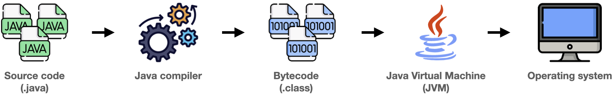
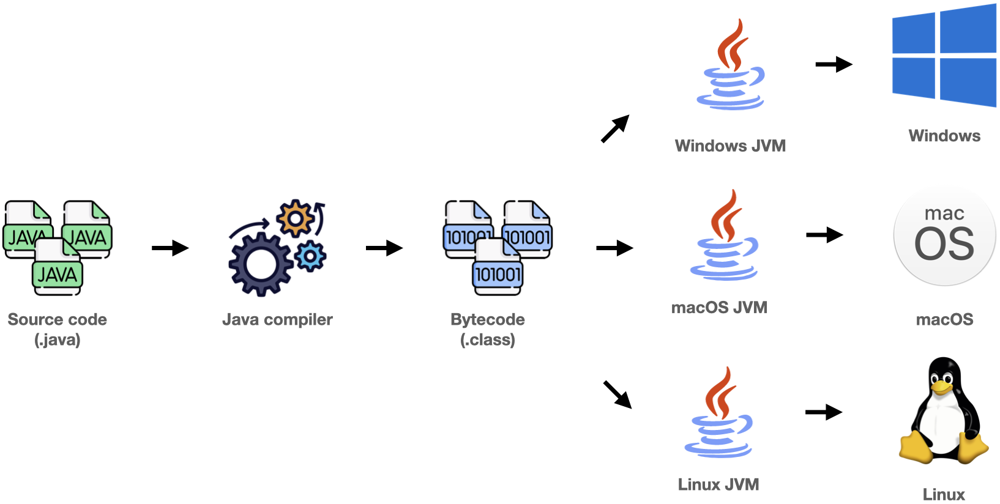
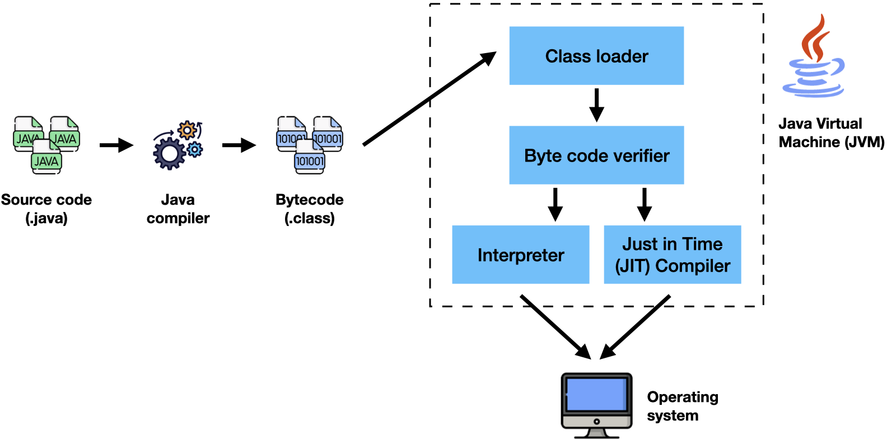

## Compilation and interpretation in Java

Java is one of these mixed languages, which combines compilation and interpretation

1. We write java code
2. We compile java code to bytecode using the Java compiler
3. We run our bytecode using the **Java Virtual Machine**
4. The JVM interprets the bytecode and generates machine code to be executed by the operating system
5. In some cases, the JVM will also compile the bytecode to machine code using the **Just-in-time compiler**



<!-- https://learning.oreilly.com/videos/java-9-core/9781787284463/9781787284463-video1_4 -->

## Compile-time errors

When we feed a bunch of text to the compiler to convert it to machine code, we may find:

- Syntax errors
- Typechecking errors

If the compiler succeeds, what do we know?

- That the program was well formed—a meaningful program in whatever language.
- That it is possible to start running the program as it is in a machine readable form. (The program might fail immediately, but at least we can try.)

## Run-time errors

We will encounter run-time errors when we feed our bytecode to the JVM, which may or may not be handled by our application.

These may be caused by:

- Division by zero
- Running out of memory
- Trying to open a file that isn’t there
- Trying find a web page and discovering that an alleged URL is not well formed

## Java bytecode

Java bytecode is the instruction set of the Java Virtual Machine.

If you think of the JVM as "a computer inside a computer", then bytecode is:

- the "machine code for the CPU of the internal computer”; or
- the “machine code for a made-up processor.”

Each bytecode is composed of:

- 1 or 2 bytes that represent an instruction
- 0 or more bytes that represent parameters

Here is an example.

The main method below...

```java
public static void main(String[] args) {
  for (int i = 1; i <= 10; i++)
    if (i % 2 == 0)
      System.out.println(i+ " is even.");
}
```

...is compiled into this in bytecode:

```bytecode
 0 iconst_5
 1 istore_1
 2 getstatic #7 <java/lang/System.out>
 5 iload_1
 6 invokevirtual #13 <java/io/PrintStream.println>
 9 new #19 <Main$Person>
12 dup
13 invokespecial #21 <Main$Person.<init>>
16 astore_2
17 getstatic #7 <java/lang/System.out>
20 aload_2
21 getfield #22 <Main$Person.age>
24 invokevirtual #13 <java/io/PrintStream.println>
27 return
```

## `javac`

The `javac` command in Java compiles a program from a command prompt. It reads a Java source program from a text file and creates a compiled Java class file.

The basic form of the `javac` command is:

```shell
javac filename [options]
```

For example, to compile a program named `HelloWorld.java`, use this command:

```shell
javac HelloWorld.java
```

Normally, `javac` compiles only the file that you specify on the command line, but you can coax `javac` into compiling more than one file at a time by:

1. If the Java file you specify on the command line contains a reference to another Java class that’s defined by a java file in the same folder, the Java compiler automatically compiles that class, too.

2. You can list more than one filename in the javac command.  

    The following command compiles three files:

    ```shell
    javac TestProgram1.java TestProgram2.java TestProgram3.java
    ```

3. You can use a wildcard to compile all the files in a folder, like this:

    ```shell
    javac *.java
    ```

## Compiling your Java class

1. Let us create a Java program that prints all even numbers from 0 to 10:  
    
    ```java
      public class Main {
        public static void main(String[] args) {
          for (int i = 1; i <= 10; i++)
            if (i % 2 == 0)
              System.out.println(i + " is even.");
        }
      }
    ```

2. Then we open a terminal and compile `Main.java` using `javac`:  
  
    ```shell
    javac Main.java
    ```

    This should generate our compiled file: `Main.class`

3. To execute our `Main.class`, we run:  
  
    ```shell
    java Main
    ```

## Java Virtual Machine (JVM)

The Java Virtual Machine (JVM) is a software that provides an environment for running Java programs.

It interprets bytecode into machine code, which it gives to the operating system to execute.

The JVM is responsible for providing on of the key features of java, **platform independence**.

Java is portable because the same Java program can be executed in multiple platforms without making any changes in the source code. 

You just need to write the java code for one platform and the same program will run in any platform.

## JVM and platform independence

Each platform has its own JVM.

All JVMs can:
- Interpret bytecode
- Convert bytecode into machine code required for its own platform
- Interact with the operating system to run the program

This makes Java programs **platform independent** and **portable**.



## What's inside the JVM?

The JVM is not a monolith, but a complex application composed of several components, including:
  - Classloader
  - Byte code verifier
  - Interpreter
  - Just in time compiler



To understand the role of these components, let us compile and run a slightly more complex Java program.

1. Write a class `Person` that contains two instance variables, `String name` and `int age`:  
    ```java
    public class Person {
      String name;
      int age;

      public Person(String name, int age) {
        this.name = name;
        this.age = age;
      }

      @Override
      public String toString() {
        return "Person{" +
                "name='" + name + '\'' +
                ", age=" + age +
                '}';
      }
    }
    ```
1. Write a class `Runner` that creates two instances of `Person` and prints their data to the console:
    ```java
    public class Runner {
      public static void main(String[] args) {
          Person tiago = new Person("Tiago", 31);
          Person davi = new Person("Davi", 1);

          System.out.println(tiago);
          System.out.println(davi);
      }
    }
    ```
1. Compile both classes:
    ```shell
    javac Person.java Runner.java
    ```
1. Execute the `Runner` class
    ```shell{outputLines:2-3}
    java Runner
    Person{name='Tiago', age=31}
    Person{name='Davi', age=1}
    ```
1. Move your `Person.class` to a subfolder called `subdir`
    ```shell
    mkdir subdir 
    mv Person.class subdir/Person.class
    ```
1. Execute the `Runner` class again. You should see something like:
    ```shell{outputLines: 2-7}
    java Runner
    Exception in thread "main" java.lang.NoClassDefFoundError: Person
          at Runner.main(Runner.java:3)
    Caused by: java.lang.ClassNotFoundException: Person
          at java.base/jdk.internal.loader.BuiltinClassLoader.loadClass(BuiltinClassLoader.java:606)
          at java.base/jdk.internal.loader.ClassLoaders$AppClassLoader.loadClass(ClassLoaders.java:168)
          at java.base/java.lang.ClassLoader.loadClass(ClassLoader.java:522)
    ```
    How could we get our program running again?

## How does the JVM find the classes in our program?

To solve this previous error, let us backtrack a little bit.

The **`java`** command is called the **Java launcher** because we use it to launch Java applications

When the Java launcher is invoked, it:
1. Gathers input from the user and the user’s environment
2. Interfaces with the JVM
3. Starts some bootstrapping

The Java Virtual Machine (JVM) does the rest of the work.

## Java class loaders

[Java class loaders](https://en.wikipedia.org/wiki/Java_Classloader) are the points of entry for code into the JVM. 

They is responsible for loading all classes into the JVM's memory.

The JVM uses several class loaders:
- The **bootstrap class loader** loads the core Java libraries located in the `<JAVA_HOME>/jre/lib` directory. This class loader, which is part of the core JVM, is written in native code.
- The **extensions class loader** loads the code in the extensions directories (`<JAVA_HOME>/jre/lib/ext`, or any other directory specified by the `java.ext.dirs` system property).
- The **system class loader** loads code found on `java.class.path`, which maps to the `CLASSPATH` environment variable.

## Classpath

Our classes are found by looking into directories identified on:
- the `-classpath` option of the command line; or
- the `CLASSPATH` environment variable.

The classpath is a list of directories, JAR files, and ZIP files that contain class files.

A class file has a subpath name that reflects the fully-qualified name of the class. For example, if the class `com.mypackage.MyClass` is stored under `myclasses`, then `myclasses` must be in the user classpath, and the full path to the class file must be: 
- `/myclasses/com/mypackage/MyClass.class` on Linux/Mac or in
- `\myclasses\com\mypackage\MyClass.class` on Windows.

If the class is stored in an archive named `myclasses.jar`, then `myclasses.jar` must be in the user classpath, and the class file must be stored in the archive as

  - `com/mypackage/MyClass.class` on Windows or in
  - `com\mypackage\MyClass.class` on Linux/Mac.

The user classpath is specified as a string, with
- a colon (`:`) to separate the classpath entries on UNIX-based systems (Linux, Mac)
- a semicolon (`;`) to separate the entries on Windows systems.

The possible sources of this value are:
- The default value of `.` (the current directory)
- The value of the `CLASSPATH` environment variable, which overrides the default value.
- The value of the `-cp` or `-classpath` command-line option, which overrides the default and `CLASSPATH` values.
- The JAR archive specified by the -jar option overrides all other values if it contains a `Class-Path` entry in its manifest. If this option is used, all user classes must come from the specified archive.

## Solving our missing class problem...

Use the **`java -cp`** command-line option to run our previous example correctly

```shell{outputLines:2-3}
java -cp subdir/:. Runner
Person{name='Tiago', age=31}
Person{name='Davi', age=1}
```

## Bytecode verifier


The **bytecode verifier** assesses the bytecode to see if it has any security issues.

It ensures that:
1. The code follows JVM specifications
2. There is no unauthorized access to memory
3. The code does not cause any stack overflows
4. There are no illegal data conversions in the code such as float to object references

Once this code is verified, the JVM converts the bytecode into machine code and the execution of the program can start.

## Just-in-time compiler

When a Java program is executed, its bytecode is interpreted by the JVM, which could be a slow process.

To overcome this issue, the JVM introduced the **Just-in-time compiler**.

When a particular bytecode is executed for the first time, the JIT compiler compiles it into native machine code.
Once the bytecode is recompiled by the JIT compiler it runs faster.

The compilation happens when the byte code is about to be executed, hence the name.

Once the bytecode is compiled into that particular machine code, it is cached by the JIT compiler to be reused, hence **the main performance improvement by using JIT compiler can be seen when the same code is executed again and again**.
