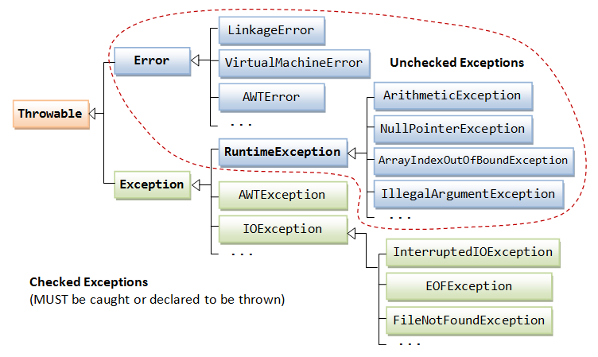

Java provides numerous exception classes, all of which are descendants of the `Throwable` class, and all allow programs to differentiate among the various types of exceptions that can occur during the execution of a program.



[source]()

## Class `Throwable`

The [**`Throwable`**](
https://docs.oracle.com/javase/8/docs/api/java/lang/Throwable.html) class is the superclass of all errors and exceptions in Java.

Only objects that are instances of this class (or one of its subclasses):
- are thrown by the runtime environment
- can be thrown by the Java `throw` statement
- can be an argument type in a `catch` clause

## Class `Exception`

An instance of [**`Exception`**](https://docs.oracle.com/javase/8/docs/api/java/lang/Exception.html) indicates a condition that a reasonable application might want to catch.

The class `Exception` and any subclasses that are not also subclasses of `RuntimeException` are called **checked exceptions**.

Checked exceptions need to be declared in a method or constructor's `throws` clause if they can be thrown by the execution of the method or constructor and propagate outside the method or constructor boundary.


## Class `RuntimeException`

[**`RuntimeException`**](
https://docs.oracle.com/javase/8/docs/api/java/lang/RuntimeException.html) is the superclass of those exceptions that can be thrown during the normal operation of the Java Virtual Machine.

RuntimeException and its subclasses are unchecked exceptions, which means that they do not need to be declared in a method or constructor's `throws` clause if they can be thrown by the execution of the method or constructor and propagate outside the method or constructor boundary.

Most runtime exceptions can be avoided by checking certain conditions:

- `NullPointerException`: Check if reference variable is null before invoking a method on it  
  ```java
  public static Integer getHead(List<Integer> list) {
    if (list != null)
      return list.get(0);

    return null;
  }
  ```
- `ArrayIndexOutOfBoundsException`: Check if the array index is less than the array length  
  ```java
  public static int getValue(int[] array, int index) {
    if (index < array.length)
        return array[index];

    return -1;
  }
  ```

## Class `Error`

An instance of [**`Error`**](https://docs.oracle.com/javase/8/docs/api/java/lang/Error.html) indicates a serious problem that a reasonable application **should not** try to catch.

Most such errors are abnormal conditions:
  - `OutOfMemoryError`: thrown when there is insufficient space to allocate an object in the Java heap
  - `StackOverflowError`: thrown when an application recurses too deeply
  - `AssertionError`: thrown when an assertion has failed

A method is not required to declare in its `throws` clause any subclasses of `Error` that might be thrown during the execution of the method but not caught, since these errors are abnormal conditions that should never occur. 

Errors are also unchecked exceptions, that is, we don't need to explicitly handle them.

