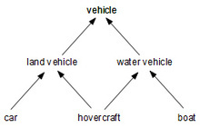

## Multiple inheritance

The example below illustrates **multiple inheritance**, a situation where a type immediately specializes two or more types: `hovercraft` specializes `land vehicle` and `water vehicle`




The counterparts of types in Java are classes and interfaces. 

As we have previously seen, Java **supports single inheritance through class extension**, in which one class directly inherits accessible fields and methods from another class by extending that class. 

Java **does not support multiple inheritance through class extension**, which is **only possible through interfaces**.

**The code below does not compile!**

```java
public class Vehicle {
  void accelerate(int targetSpeed) {
    System.out.println("Vehicle: Accelerate to " + targetSpeed);
  }
}

public class WaterVehicle extends Vehicle {
  void turn(int radius) {
    System.out.println("WaterVehicle: Turning " + radius);
  }
}

public class LandVehicle extends Vehicle {
  void turn(int radius) {
    System.out.println("LandVehicle: Turning " + radius);
  }
}

// THIS WON'T COMPILE BECAUSE MULTIPLE CLASS INHERITANCE IS FORBIDDEN
public class Hovercraft extends LandVehicle, WaterVehicle {
  void accelerateAndTurn(int targetSpeed, int radius) {
    accelerate(targetSpeed);
    turn(radius);
  }
}
```

What if these were interfaces?

```java
public interface Vehicle {
  void accelerate(int targetSpeed);
}

public interface WaterVehicle extends Vehicle {
  void turn(int radius);
}

public interface LandVehicle extends Vehicle {
  void turn(int radius);
}

public class Hovercraft implements LandVehicle, WaterVehicle {
  @Override
  public void accelerate(int targetSpeed) {
    System.out.println("Hovercraft: Accelerate to " + targetSpeed);
  }

  @Override
  public void turn(int radius) {
    System.out.println("Hovercraft: Turning " + radius);
  }
  
  void accelerateAndTurn(int targetSpeed, int radius) {
    accelerate(targetSpeed);
    turn(radius);
  }
}
```

What if we had default methods?

```java
public interface Vehicle {
  void accelerate(int targetSpeed);
}

public interface WaterVehicle extends Vehicle {
  default void turn(int radius) {
    System.out.println("WaterVehicle: Turning " + radius);
  }
}

public interface LandVehicle extends Vehicle {
  default void turn(int radius) {
    System.out.println("LandVehicle: Turning " + radius);
  }
}

public class Hovercraft implements LandVehicle, WaterVehicle {
  @Override
  public void accelerate(int targetSpeed) {
    System.out.println("Hovercraft: Accelerate to " + targetSpeed);
  }

  void accelerateAndTurn(int targetSpeed, int radius) {
    accelerate(targetSpeed);
    turn(radius);
  }

  @Override
  public void turn(int radius) {
    LandVehicle.super.turn(radius);
  }
}
```