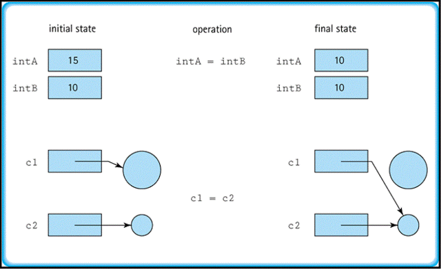

 
## `Object` and its methods

`Object` is the root class of all other Java classes (including arrays).

`Object` is located in the `java.lang` package.

`Object` declares the following methods, which all other classes inherit:
- `protected Object clone()`
- `boolean equals(Object obj)`
- `protected void finalize()`
- `Class<?> getClass()`
- `int hashCode()`
- `String toString()`
- `void notify()`
- `void notifyAll()`
- `void wait()`
- `void wait(long timeout)`
- `void wait(long timeout, int nanos)`

These methods allow you to perform special tasks in your Java classes.

## Extending `Object`

You can extend `Object` *explicitly*:

```java
public class Employee extends Object {
  String name;

  public Employee(String name) {
    this.name = name;
  }

  public String getName() {
    return name;
  }

  public static void main(String[] args) {
    Employee e = new Employee("Tiago");
    System.out.println(e.getName());
  }
}
```

Or *implicitly*:

```java
public class Employee {
   private String name;
   // ...
}
```

Less is more in this case, so pick the implicit alternative.

## `getClass()`

The `getClass()` method returns the runtime class of the object on which this method is called.

```java
Someclass s = new Someclass();
Class c = s.getClass();
```
   
The runtime class is represented by a `Class` object (from the `java.lang` package).

A `Class` object is sort of a meta object describing the class of an object.

It contains the following data about the class:
- name
- package
- methods
- fields
- constructors
- annotations	

## Exercise 8

Create the class `Something`:
- `int a` + getter/setter

Create a class `Runner` with a main method that:
- create an instance of `Something`
- create the runtime object using `getClass()`
- print the name of the instance
- print the name of the superclass
- print the first field member using `getDeclaredFields()`

<!-- ## Solution

```java
public class Something {
   private int a = 0;
   public int b = 0;

   public int getA() {
     return a;
   }

   public void setA(int a) {
     this.a = a;
   }
}
```

```java
import java.lang.reflect.Field;

public class Runner {
   public static void main(String[] args) {
      Something s = new Something();

      Class c = s.getClass();

      System.out.println(c.getName());
      System.out.println(c.getSuperclass());

      Field[] fields = c.getDeclaredFields();
      for (Field field : fields)
         System.out.println(field);
   }
}
``` -->

## Object duplication

**How do we achieve a true distinct copy of an object?**



## `clone()`

The `clone()` method creates and returns a copy of the object on which it is called.

It always returns an `Object`, hence it  **must be cast** to the object's actual type 

To create a clone, write:

```java
aCloneableObject.clone();
```

The `Object`'s implementation of this method **checks to see whether the object on which `clone()` was invoked implements the `Cloneable` interface**. If it does not, the method throws a `CloneNotSupportedException` exception. 

The default implementation of `clone()`:
- Creates an object of the same class as the original object
- Initializes the new object's member variables to have the same values as those of the original object

The simplest way to make your class cloneable is to:
- Implement the `Cloneable` interface
- Implement `clone()` by invoking `super.clone()`:

```java
@Override
protected Object clone() throws CloneNotSupportedException {
  return super.clone();
}
```

You can also write you own implementation of `clone()`

## Exercise 9

1. Reuse the class `Something` from the last exercise
	- add implements Cloneable
	- override `public Object clone()`
2. Make a `Runner` class that
	- make an instance s1 of `Something`
		- set a=10
		- print the value of s1.a
	- make an instance s2 of `Something`
		- set a=20
		- print the value of s1.a, s2.a
	- make a variable s3 and assign it to s1
		- set a = 30
		- print the value of s1.a, s2.a, s3.a
	- make a variable s4 and assign it to a clone of s2
		- set a = 40
		- print the value of s1.a, s2.a, s3.a, s4.a

<!-- ## Solution

```java
public class Something implements Cloneable {
    public int a = 0;

		public Something(int a) {
        this.a = a;
    }

    public int getA() {
        return a;
    }

    public void setA(int a) {
        this.a = a;
    }

    @Override
    protected Object clone() throws CloneNotSupportedException {
        return super.clone();
    }
}
```

```java
public class Runner {
   public static void main(String[] args) {
      Something s1 = new Something(10);
      Something s3 = s1;
      System.out.println("s1=" + s1.a);
      System.out.println("s3=" + s3.a);
      s3.a = 30;
      System.out.println("s1=" + s1.a);
      System.out.println("s3=" + s3.a);
      System.out.println(); 
      try {
         Something s2 = new Something(20);
         Something s4 = (Something) s2.clone();
         System.out.println("s2=" + s2.a);
         System.out.println("s4=" + s4.a);  
         s4.a = 40;
         System.out.println("s2=" + s2.a);
         System.out.println("s4=" + s4.a);
      } catch (CloneNotSupportedException e) {
         e.printStackTrace();
      }
  }
}

```

```output
s1=10
s3=10
s1=30
s3=30

s2=20
s4=20
s2=20
s4=40
``` -->

## Comparing objects

We can compare reference variables using:
- **Referential equality**: compares two variables to determine if they refer to the same object
- **Content equality**: compares two objects to determine if they have the same contents (i.e. instance variables)

When you use `==` on **primitive variables**, it performs a **content equality** check:

```java
int x = 10;
int y = 10;
System.out.println("x==y: " + (x == y));
// => x==y: true
```

When you use `==` on **reference variables**, it performs a **referential equality** check:

```java
Person a = new Person("Tiago", 30);
Person b = new Person("Tiago", 30);
System.out.println("a==b: " + (a == b));
// => a==b: false
```

**What if we want to compare objects by their content?**

## `equals()`

The `equals()` method lets you compare the contents of two objects to see if they are equal.

`Object`'s default implementation of `equals()` performs a referential equality check.

To perform content equality, we need to override `equals()`. 

The rules for overriding this method are stated in Oracle's official documentation for the `Object` class:
- Be **reflexive**: For any non-null reference value x, `x.equals(x)` should return true.
- Be **symmetric**: For any non-null reference values x and y, `x.equals(y)` should return true if and only if `y.equals(x)` returns true.
- Be **transitive**: For any non-null reference values x, y, and z, if `x.equals(y)` returns true and `y.equals(z)` returns true, then `x.equals(z)` should return true.
- Be **consistent**: For any non-null reference values x and y, multiple invocations of `x.equals(y)` consistently return true or consistently return false, provided no information used in equals comparisons on the objects is modified.
- For any non-null reference value x, `x.equals(null)` should return false.

When overriding `equals()`, it's common practice to also override the `hashCode()` method.

## Content equality: Example

Here is how you can compare the contents of two objects:

```java
class Employee {
  private String name;
  private int age;

  public Employee(String name, int age) {
    this.name = name;
    this.age = age;
  }

  public String getName() {
    return name;
  }

  public int getAge() {
    return age;
  }

  @Override
  public boolean equals(Object obj) {
    if (this == obj) return true;
    if (!(obj instanceof Employee)) return false;

    Employee e = (Employee) obj;
    return e.getName().equals(name) && e.getAge() == age;
  }

}
```

The Java `instanceof` operator is used to test whether the object is an instance of the specified type (class or subclass or interface).

```java
public class Equals {
  public static void main(String[] args) {
    Employee e1 = new Employee("Tiago", 30);
    Employee e2 = new Employee("Tiago", 30);

    System.out.println("Is e1 equals to e1: " + e1.equals(e1));

    System.out.println("Is e1 equals to e2: " + e1.equals(e2));
    System.out.println("Is e2 equals to e1: " + e2.equals(e1));

    Employee e3 = new Employee("Tiago", 35);

    System.out.println("Is e1 equals to e3: " + e1.equals(e3));
    System.out.println("Is e3 equals to e1: " + e3.equals(e1));

    Employee e4 = new Employee("Camila", 30);

    System.out.println("Is e1 equals to e4: " + e1.equals(e4));
    System.out.println("Is e4 equals to e1: " + e4.equals(e1));
  }
}
```

```output
Is e1 equals to e1: true
Is e1 equals to e2: true
Is e2 equals to e1: true
Is e1 equals to e3: false
Is e3 equals to e1: false
Is e1 equals to e4: false
Is e4 equals to e1: false
```

## Exercise 10

Write a class `Land`, containing:
- int width
- int length
- getArea()

Override the `equals()` method in such a way that **returns true if the area (width\*length) is equal in both objects**, e.g. `Land(10,10) = Land(20,5)`

<!-- ## Solution

```java
public class Land {
  int width = 0;
  int length = 0;

  public int getArea() {
    int area = width * length;
    return area;
  }

  @Override
  public boolean equals(Object obj) {
    if (!(obj instanceof Land)) {
      return false;
    }

    Land land = (Land) obj;
    return land.getArea() == this.getArea();
  }

  public Land(int w, int l) {
    super();
    this.width = w;
    this.length = l;
  }
}
```

```java
public class Runner {
   public static void main(String[] argl) {
      Land l1 = new Land(100, 200);
      System.out.println("w: " + l1.width + ", l: " + l1.length + ", a: " + l1.getArea());

      Land l2 = new Land(500, 4);
      System.out.println("w: " + l2.width + ", l: " + l2.length + ", a: " + l2.getArea());

      System.out.println("Is l1 equals to l2: " + l1.equals(l2));

      Land l3 = new Land(500, 600);
      System.out.println("w: " + l3.width + ", l: " + l3.length + ", a: " + l3.getArea());

      System.out.println("Is l1 equals to l3: " + l1.equals(l3));
      System.out.println("Is l2 equals to l3: " + l2.equals(l3));
   }
}
``` -->

## `toString()`

The `toString()` method returns a string representation of the object on which the method is called.

It is quite useful for debugging purposes.

By default, `toString()` return a value in the format `classname@hashcode`, where hashcode is shown in hexadecimal notation.

```java
Employee me = new Employee("Tiago", 30);
System.out.println(me);
```
```output
Employee@424058530
```

To get more meaningful messages, we can override this method:

```java
public class Employee {
  private String name;
  private int age;

  public Employee(String name, int age) {
    this.name = name;
    this.age = age;
  }

  public String getName() {
    return name;
  }

  public int getAge() {
    return age;
  }

  @Override
  public String toString() {
    return "Employee{" +
            "name='" + name + '\'' +
            ", age=" + age +
            '}';
  }
}
```

```output
Employee{name='Tiago', age=30}
```

