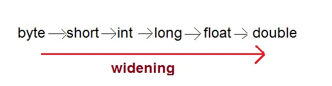
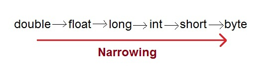
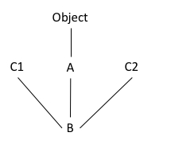

The Java type system is made up of two kinds of types: 
- primitives
- references


## Casting

Casting (conversion) of primitives and references are **two different things**

Primitive casting:
1. Widening (implicit, automatic) casting
2. Narrowing (explicit) casting


## Widening primitive casting

1 byte -> 2 bytes -> 4 bytes -> 8 bytes



```java
int i = 100;
long l = i;	//no explicit type casting required
float f = l;	//no explicit type casting required
System.out.println("Int value "+i);
System.out.println("Long value "+l);
System.out.println("Float value "+f);
```

```ini
Int value 100
Long value 100
Float value 100.0
```

## Narrowing primitive casting

8 bytes -> 4 bytes -> 2 bytes -> 1 bytes



```java
double d = 100.04;
long l = (long)d;  //explicit type casting required
int i = (int)l;	//explicit type casting required

System.out.println("Double value "+d);
System.out.println("Long value "+l);
System.out.println("Int value "+i);
}
```

```ini
Double value 100.04
Long value 100
Int value 100
```

Narrowing primitive casting may have unpredictable consequences:

```java
double d = 108374658347560.04;
long l = (long)d;  //explicit type casting required
int i = (int)l;	//explicit type casting required

System.out.println("Double value "+d);
System.out.println("Long value "+l);
System.out.println("Int value "+i);
```

```ini
Double value 1.0837465834756005E14
Long value 108374658347560
Int value -251432408
```

## Reference casting

Reference variables only refer to objects but do not contain the objects themselves.

Casting a reference variable doesn’t touch the object it refers to, it only labels this object in another way, expanding or narrowing opportunities to work with it.

**Upcasting** narrows the list of methods and properties available to the object.

**Downcasting** may extend the list of methods and properties available to the object.


## Upcasting reference variables

Casting from a subclass to a superclass is called **upcasting**:

```java
public class Animal {
  public void eat() {
      // ... 
  }
}

public class Cat extends Animal {
  public void meow() {
        // ... 
  }
}
```

```java
Cat cat = new Cat();
Animal animal = cat; //implicit
animal = (Animal) cat; //explicit: not needed in upcasting
```

We’ve restricted the number of methods available to Cat instance but haven’t changed the instance itself.

```java
Cat cat = new Cat();
Animal animal = cat; 

cat.meow();		// ok
animal.meow();  // not ok: method meow() is undefined for the type Animal
```

## Downcasting reference variables

Casting from a a superclass to a subclass is called **downcasting**:

```java
public class Animal {
  public void eat() {
      // ... 
  }
}

public class Cat extends Animal {
  public void meow() {
        // ... 
  }
}
```

```java
Animal animal = new Cat();
Cat cat = (Cat) animal;
```

## Exercise 11

1. Write class A:
    - Add methodA()
1. Write class B:
    - It extends A
    - Add methodB()
1. Try upcasting and downcasting

<!-- ## Solution

```java
class A {
    public void methodA(){ System.out.println("Does A"); }
}

class B extends A {
    public void methodB(){ System.out.println("Does b"); }
}

public class Runner {
    public static void main(String[] args) {
        A a = new A();
        a.methodA();
    
        B b = new B();
        b.methodA();
        b.methodB();

        A a2 = new B();
        a2.methodA();

        A a3 = new B(); //we don't have access to methodB()
        a3.methodA();
        B b2 = (B) a3;
        b2.methodB(); //downcasting

        B b3 = (B) new A();
        b3.methodA();
        b3.methodB();	//runtime error
    }
}
``` -->

## Casting with Interfaces

Consider the scenario below:



```java
public interface C1 { ...}
public interface C2 { ...}
public class A { ... }
class B extends A implements C1, C2 { ... }
```

Given this hierarchy, all the following statements are valid:

```java
B b = new B();
A a	= (A) b;
C1 c1 = (C1) b;
C2 c2 = (C2) b;
C1 c11 = (C1)(A) b;
```

Now, supposed that both `A` and `B` implement the method `whoAmI()`

```java
public class A {
  public void whoAmI() {
    System.out.println("I am A.");
  }
}

public class B extends A implements C1, C2 {
  @Override
  public void whoAmI() {
    System.out.println("I am B.");
  }
}
```

In our `main()` we write the following instructions:

```java
B b = new B();
A a	= (A) b;
C1 c1 = (C1)b;
C2 c2 = (C2)b;

c1.whoAmI(); // compile error: not accessible through C1
c2.whoAmI(); // compile error: not accessible through C2

b.whoAmI(); // which version of the method will be invoked?
a.whoAmI(); // which version of the method will be invoked?
```

Which version of `whoAmI()` is going to be called in each line?
- `A.whoAmI()`
- `B.whoAmI()`

The answer is **always the overrided one**:

```ini
I am B.
I am B.
```

Remember that both `b` and `a` point to the same object of type `B`, which has the following methods:
- `whoAmI()`
- `anotherMethod()`
- the difference between variables `a` and `b` is only in the methods that are accessible

Through `b` we have access to the methods (of the object of type `B`)
- `whoAmI()`
- `anotherMethod()`

Through `a` we have access only to the method (of the object of type `B`)
- `whoAmI()`


## Exercise 12

1. Create an interface `Sortable` that contains
	- a method `boolean isBiggerThan(Sortable obj)`
1. Create class `Building implements Sortable`
	- a field `int height` with a corresponding getter and setter
1. Create class `Land implements Sortable`
	- a field `int width` with a corresponding getter and setter
  - a field `length` with a corresponding getter and setter
1. Create a class `Runner` with a `main` method that:
	- Creates three `Building` objects with heights 20, 80, and 60 meters
	- Creates three `Land` objects of the sizes 20x30, 10x5, and 25x25 square meters
	- Find the tallest building
	- Find the largest land
