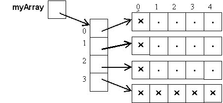

A **multidimensional array** can be simply defined as an array of arrays. 

We declare a such an array by using two or more square brackets:

```java
String[][] names;
int[][][] cube;
```

We add one pair of square brackets per dimension we want in our array.

A two-dimensional array resembles a table, while a three-dimensional array, a cube.
   
Declaring and constructing a multidimensional array:

```java
String[][] names = new String[2][2];
int[][][] cube = new int[3][3][3];
```

Declaring, constructing, and initializing a multidimensional array:

```java
String[][] names = {{"Tiago", "Prince", "Sales"}, {"Davi", "Sitonio", "de Prince"}};
int[][][] cube = {{{1, 2}, {3, 4}}, {{5, 6}, {7, 8}}};
```

Each element must be accessed by a corresponding number of index values:

```java
names[0][1]
cube[0][0][0]
```

[Source](https://docs.oracle.com/javase/tutorial/java/nutsandbolts/arrays.html)

## Multidimensional arrays in memory

This is what our multidimensional arrays look like in memory:



[Source](http://pages.cs.wisc.edu/~gerald/cs302/labs/lab06/lab06.html)


## About multidimensional arrays

Multidimensional arrays may have sub-arrays of different sizes:

```java
int[][] array2 = {{1, 2}, {3}, {4, 5, 6}};
```
   
In two-dimensional arrays (aka matrices), by convention, we assume that:
- the first dimension represents the rows
- the second dimension represents the columns

## Iterating over elements of a multidimensional array

Here is an example on how to iterate over all the elements of a multidimensional array:

```java
public class TwoDimensionalArrays {
  public static void main(String[] args) {
    int[][] array1 = {{1, 2, 3}, {4, 5, 6}};
    int[][] array2 = {{1, 2}, {3}, {4, 5, 6}};

    System.out.println("\nValues in array1 by row are: ");
    printTwoDimensionalArray(array1);

    System.out.println("\nValues in array2 by row are: ");
    printTwoDimensionalArray(array2);
  }

  public static void printTwoDimensionalArray(int[][] array) {
    for (int row = 0; row < array.length; row++) {
      System.out.print("[");

      for (int column = 0; column < array[row].length; column++) {
        System.out.print(array[row][column]);

        if (column < array[row].length - 1) {
          System.out.print(", ");
        }
      }

      System.out.println("]");
    }
  }
}
```

## Exercise 3

Lets us revisit exercise 1 with multidimensional arrays. 

Write a second `sum` method that sums all the numbers is a tri-dimensional array.

```java
public class SummingArrays {
  public static int sum(int[][][] cube) {
    // FIX ME
    return -1;
  }

  public static void main(String[] args) {
    int[][][] cube1 = {
            {{1, 1}, {1, 1}, {1, 1}},
            {{1, 1}, {1, 1}, {1, 1}},
            {{1, 1}, {1, 1}, {1, 1}}
    };

    System.out.println("Should return 18 for cube1 = " + sum(cube1));

    int[][][] cube2 = {
            {{1, 0}, {1, 0}, {1, 0}},
            {{1, 0}, {1, 0}, {1, 0}},
            {{1, 0}, {1, 0}, {1, 0}},
    };

    System.out.println("Should return 9 for cube2 = " + sum(cube2));
  }
}
```