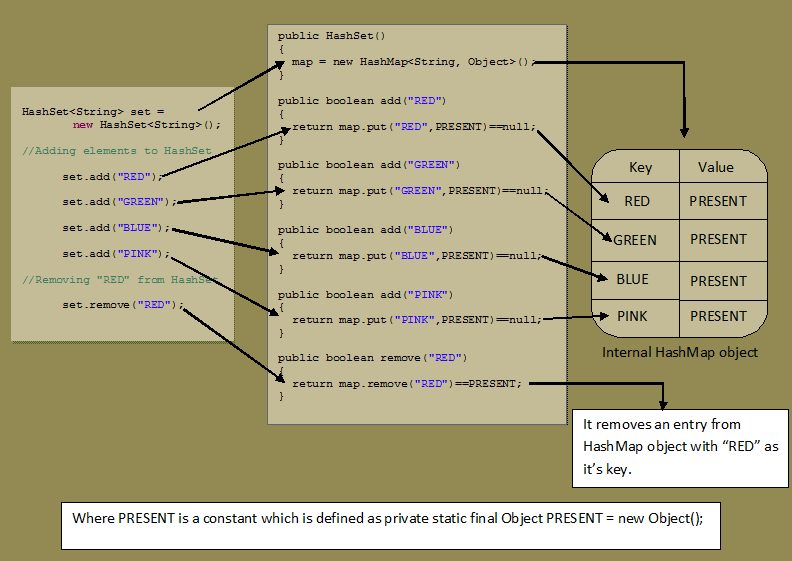

## Interface: `Set<E>`

Set is an **abstract data structure** that:
- Stores a collection of values 
- Stores values in **no particular order**
- Prohibits **repeated values**

It is an implementation of the mathematical concept of a finite set, which is typically used to **test a value for membership**.

Set, as a **Java interface**:
- Inherits methods from `Collection`
- Prohibits duplicate elements 

## `Set<E>`: Main methods

- `void clear()`: Removes all of the elements from the set.
- `boolean contains(Object o)`: 	 Returns true if the set contains the specified element.
- `boolean add(Object o)`: Adds the specified element to the set if it is not already present.
- `boolean isEmpty()`: Returns true if the set contains no elements.
- `boolean remove(Object o)`  Removes the specified element from the set if it is present.
- `Iterator iterator()` Returns an iterator over the elements in the set.
- `int size()` Returns the number of elements in the set.

## Classes: `HashSet`, `LinkedHashSet`, `TreeSet`

`HashSet`:
- Implements `Set`
- No order guaranteed

`LinkedHashSet`:
- Implements `Set` 
- Extends `HashSet`
- Insertion order maintained

`TreeSet`:
- Implements `OrderedSet`
- Natural order maintained

Here is an example of how these three classes behave:

```java
public static void main(String[] args) {
  Set<String> hashSet = new HashSet<>();
  hashSet.add("Joey");
  hashSet.add("Joey");
  hashSet.add("Rachel");
  hashSet.add("Monica");
  hashSet.add("Chandler");
  System.out.println("HashSet (no order guaranteed): " + hashSet);

  Set<String> linkedHashSet = new LinkedHashSet<>();
  linkedHashSet.add("Joey");
  linkedHashSet.add("Joey");
  linkedHashSet.add("Rachel");
  linkedHashSet.add("Monica");
  linkedHashSet.add("Chandler");
  System.out.println("LinkedHashSet (insertion order maintained): " + linkedHashSet);

  Set<String> treeSet = new TreeSet<>();
  treeSet.add("Joey");
  treeSet.add("Joey");
  treeSet.add("Rachel");
  treeSet.add("Monica");
  treeSet.add("Chandler");
  System.out.println("TreeSet (natural order maintained): " + treeSet);
}
```

```output
HashSet (no order guaranteed): [Rachel, Joey, Chandler, Monica]
LinkedHashSet (insertion order maintained): [Joey, Rachel, Monica, Chandler]
TreeSet (natural order maintained): [Chandler, Joey, Monica, Rachel]
```

## Class: `HashSet<E>`

A `HashMap`-based implementation of the `Set` interface.

Characteristics:
- No repeated elements (from `Set`)
- Stores elements using a `HashMap`
- Does not guarantee element order
- Allows `null`
- Implements all optional `Set` operations
   
`HashSet` uses `HashMap` internally to store it’s objects.

The elements you add into a `HashSet` are stored as keys of this `HashMap` object and the values associated with those keys are a constant.



## Class: `LinkedHashSet<E>`

A `LinkedHashMap`-based implementation of the `Set` interface.

Characteristics:
- No repeated elements (from `Set`)
- Its `HashMap` nature guarantees unique elements
- Its `LinkedList` nature guarantees insertion order
- Allows `null`
- Implements all optional `Set` operations
   
When we invoke `add()` on a `LinkedHashSet`:

```java
set.add(x);
```

It internally calls the `put()` method of its `LinkedHashMap`:

```java
public boolean add(E e) {
  return m.put(e, PRESENT)==null;
}
```       

Here is a demo of `LinkedHashSet`:

```java
public static void main(String args[]) {
  // create a Hash set
  LinkedHashSet hs = new LinkedHashSet();
  
  // add elements to the LinkedHashSett
  hs.add("B");
  hs.add("A");
  hs.add("D");
  hs.add("E");
  hs.add("C");
  hs.add("F");
  hs.add("A");
  System.out.println(hs);
}
```

```output
[B, A, D, E, C, F]
```

## Interface: `SortedSet`

An extension of `Set` in which the elements are always sorted.

The elements are ordered using:
- Their natural ordering, or 
- A `Comparator` typically provided at sorted set creation time .

The set's iterator will traverse the set in ascending element order. 

## Class: `TreeSet<E>`

A `TreeMap`-based implementation of the `OrderedSet` interface

Characteristics:
- No repeated elements (from `Set`)
- Its `TreeMap` component guarantees:
    - unique elements
    - ascending natural element order
- Does not allow `null`
- Implements all optional `Set` operations

When we invoke `add()` on a `TreeSet`:

```java
set.add(x);
```
  
It internally calls the `put()` method of its `TreeMap`:

```java
public boolean add(E e) {
  return m.put(e, PRESENT)==null;
}
```
    
Here is a demo of `TreeSet`:

```java
public static void main(String[] args) {
  TreeSet<String> treeSet = new TreeSet<>();
  treeSet.add("Red");
  treeSet.add("Blue");
  treeSet.add("Black");
  treeSet.add("Green");
  treeSet.add("Yellow");

  System.out.println("TreeSet: " + treeSet);

  String lowest = treeSet.first();
  System.out.println("Lowest element in the set: " + lowest);

  String highest = treeSet.last();
  System.out.println("Highest element in the set: " + highest);

  SortedSet<String> headSet = treeSet.headSet("Green");
  System.out.println("Subset with elements lower than \"Green\": " + headSet);

  SortedSet<String> tailSet = treeSet.tailSet("Green");
  System.out.println("Subset with elements higher or equal than \"Green\": " + tailSet);
}
```

```output
TreeSet: [Black, Blue, Green, Red, Yellow]
Lowest element in the set: Black
Highest element in the set: Yellow
Subset with elements lower than "Green": [Black, Blue]
Subset with elements higher or equal than "Green": [Green, Red, Yellow]
``` 
