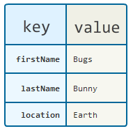

A map contains values on the basis of keys, i.e. key and value pairs. 

Each key and value pair **is known as an entry.** 



A map contains **unique keys**, while it may hold repeated values.

It is a useful data structure if you have to search, update, or delete elements on the basis of a key.


## Interface: `Map<K,V>`

```java
import java.util.*;

public class MainMethods {
   public static void main(String[] args) {
      // Constructs an empty map
      Map<String, Integer> gradesMap = new HashMap<>();

      // Adding entries to the map
      gradesMap.put("Sheldon", 30);
      gradesMap.put("Leonard", 25);
      gradesMap.put("Rajesh", 26);
      System.out.println(gradesMap);

      // Getting the value for an existing key
      System.out.println("Leonard's grade: "+gradesMap.get("Leonard"));

      // Remember that keys are unique in a map.
      // Adding an entry for an existing key replaces the existing value
      gradesMap.put("Rajesh", 18);
      System.out.println(gradesMap);

      System.out.println("Is Rajesh's grade declared? "+gradesMap.containsKey("Rajesh"));
      System.out.println("Did anyone get the maximum score? "+gradesMap.containsValue(30));

      Map<String, Integer> gradesMap2 = new HashMap<>();
      gradesMap2.put("Howard", 22);
      // Adding all entries from secondGradeMap into gradesMap
      gradesMap.putAll(gradesMap2);
      System.out.println(gradesMap);
   }
}
```

## `Map<K,V>`: Iterating over elements

```java
import java.util.*;

public class Iterating {
   public static void main(String[] args) {
      Map<String, Integer> gradesMap = new HashMap<>();
      gradesMap.put("Sheldon", 30);
      gradesMap.put("Leonard", 25);
      gradesMap.put("Rajesh", 26);
      gradesMap.put("Howard", 21);
      System.out.println(gradesMap);

      // Iterate using a for-each loop on the KEYS in the map
      for (String key : gradesMap.keySet()) {
         System.out.println("("+key + ", " + gradesMap.get(key)+")");
      }

      // Iterate using a for-each loop on the VALUES in the map
      for (Integer value : gradesMap.values()) {
         System.out.println(value);
      }

      // Iterate using a for-each loop on the ENTRIES in the map
      for (Map.Entry entry : gradesMap.entrySet()) {
         System.out.println(entry);
      }

      // Iterate using a forEach method
      gradesMap.forEach( (key, value) -> System.out.println(key + ": " + value));
   }
}
```

## Map and Collections

Map is formally not part of Java Collections.

***Why doesn't `Map` extend `Collection`?***

> This was by design. We feel that mappings are not collections and collections are not mappings. Thus, it makes little sense for Map to extend the Collection interface (or vice versa).
> 
> If a Map is a Collection, what are the elements? The only reasonable answer is "Key-value pairs", but this provides a very limited (and not particularly useful) Map abstraction. You can't ask what value a given key maps to, nor can you delete the entry for a given key without knowing what value it maps to.
> 
> Collection could be made to extend Map, but this raises the question: what are the keys? There's no really satisfactory answer, and forcing one leads to an unnatural interface.
> 
> Maps can be viewed as Collections (of keys, values, or pairs), and this fact is reflected in the three "Collection view operations" on Maps (keySet, entrySet, and values). While it is, in principle, possible to view a List as a Map mapping indices to elements, this has the nasty property that deleting an element from the List changes the Key associated with every element before the deleted element. That's why we don't have a map view operation on Lists.


From [https://docs.oracle.com/javase/8/docs/technotes/guides/collections/designfaq.html#a14](https://docs.oracle.com/javase/8/docs/technotes/guides/collections/designfaq.html#a14)


## Class: `HashMap<K,V>`

A Hashtable-based implementation of the `Map` interface that extends `AbstractMap`.

Main characteristics:
- Contains values based on keys
- May contain at most one `null` key
- May contain any number of `null` values
- **Does not maintain any particular key order**

Here is an example:

```java
public class HashMapDemo {
  public static void main(String[] args) {
      HashMap<String, Integer> hashMap = new HashMap<>();
      hashMap.put("Rajesh", 26);
      hashMap.put("Sheldon", 30);
      hashMap.put("Leonard", 25);
      System.out.println("A map that keeps no particular order: "+hashMap);
  }
}
```

```output
A map that keeps no particular order: {Sheldon=30, Rajesh=26, Leonard=25}
```

## Exercise 4

Write a main method that creates a `HashMap<String,String>` and add the pairs:
- `"font_face"`: `"Times New Roman"`
- `"font_size"`: `10`
- `"margin"`: `4`
- `"auto_indent"`: `true`

Then, print out the number of entries and the value of all pairs, except for the key `"font_face"`.s

<!-- ## Solution

```java
import java.util.HashMap;
import java.util.Map;

public class Runner {

   public static void main(String[] args) {
      HashMap<String, String> config = new HashMap<>();
      config.put("font_face", "Times New Roman");
      config.put("font_size", "10");
      config.put("margin", "4");
      config.put("auto_indent", "true");

      System.out.println(config.size());

      for (Map.Entry m : config.entrySet()) {
         if (!m.getKey().equals("font_face"))
            System.out.println(m.getKey() + ": " + m.getValue());
      }
   }
}
``` -->

## Hashing

**Definition:** A hash function is any function that can be used to map data of **arbitrary size** to data of **fixed size**. 

The values returned by a Hash function are called hash values, hash codes, digests, or simply Hashes. 

In a `HashMap` we use the hashes instead of the full key values, which drastically speeds up search.


| hash(key) | value  |
|-----------|--------|
| 01        | male   |
| 02        | female |
| 04        | male   |


A hash function that is **injective**—that is, maps each valid input to a different hash value, is said to be **perfect**. In most cases, however, a hash function is **non-perfect**, thus requiring collision resolution.

When two items Hash to the same slot, we must have a systematic method for placing the second item in the Hash table.

## Hashing in `HashMap<K,V>`

What to do when two different keys have the same hashcode?

The `equals()` method comes to rescue!
- We traverse the linked list, comparing keys in each entry using `equals()` until it returns `true`.  
- The corresponding entry object value is returned.

Read [this](https://medium.com/@mr.anmolsehgal/java-hashmap-internal-implementation-21597e1efec3) article for more details.

## Exercise 5

Implement the `getHash(String s)` hash method of the `MyHash` class such that it maps any `String` into a `int`  between `0` to `99`.

```java
public class MyHash {

  public static int getHash(String s) {
    // FIX ME
  }

  public static void main(String[] args) {
    System.out.println("Java: " + getHash("Java"));
    System.out.println("Oracle: " + getHash("Oracle"));
    System.out.println("JDK: " + getHash("JDK"));
    System.out.println("JVM: " + getHash("JVM"));
    System.out.println("IntelliJ: " + getHash("IntelliJ"));
    System.out.println("Eclipse: " + getHash("Eclipse"));
    System.out.println("Class: " + getHash("Class"));
    System.out.println("class: " + getHash("class"));
  }

}
```

<!-- ## Solution

```java
public class MyHash {
	
	public int getHash(String s) {
		byte[] bs = s.getBytes();
		int sum = 0;
		for(int i =0; i<bs.length;i++) {
			sum+=bs[i];
		}
		return sum % 100;
	}

}
``` -->

## Class: `LinkedHashMap<K,V>`

The `LinkedHashMap` class is hash table and linked list implementation of the `Map` interface, with **predictable iteration order**.

It inherits HashMap class and implements the Map interface.

A `LinkedHashMap<K,V>`:
- contains values based on keys
- contains only unique elements
- may have at most one null key (there might be any number of null values)
- behaves mostly like a HashMap, but instead, **it maintains insertion order**

Here is an example:

```java
import java.util.*;

public class Runner {
  public static void main(String[] args) {
      LinkedHashMap<String, Integer> linkedHashMap = new LinkedHashMap<>();
      
      linkedHashMap.put("Rajesh", 26);
      linkedHashMap.put("Sheldon", 30);
      linkedHashMap.put("Leonard", 25);
      
      System.out.println("A map that keeps insertion order: "+linkedHashMap);
  }
}
```

```output
A map that keeps insertion order: {Rajesh=26, Sheldon=30, Leonard=25}
```

Read [this](https://medium.com/@mr.anmolsehgal/java-linkedhashmap-internal-implementation-44e2e2893036) article for more details.

## Class: `TreeMap<K,V>`

The `TreeMap` class implements the `Map` interface by using a tree. 

It provides an efficient means of storing key/value pairs in **sorted order by key**.

A `TreeMap<K,V>`:
- contains values based on the key. It implements the NavigableMap interface and extends AbstractMap class.
- contains only unique elements.
- cannot have a null key, but can have multiple null values.
- It behave mostly like a HashMap, but instead, **it maintains a natural ordering of the keys**


Here is an example:

```java
import java.util.*;

public class Runner {
  public static void main(String[] args) {
      TreeMap<String, Integer> treeMap = new TreeMap<>();
      treeMap.put("Rajesh", 26);
      treeMap.put("Sheldon", 30);
      treeMap.put("Leonard", 25);
      System.out.println("A map that keeps a natural ordering: "+treeMap);
  }
}
```

```output
A map that keeps a natural ordering: {Leonard=25, Rajesh=26, Sheldon=30}
```

## `HashMap` vs `LinkedHashMap` vs `TreeMap`


Table from [this](https://stackoverflow.com/questions/2889777/difference-between-hashmap-linkedhashmap-and-treemap) StackOverflow question.

## Exercise 6

- Create a main method with 3 <String,String> maps:
	- 1 HashMap
	- 1 LinkedHashMap
	- 1 TreeMap
- To each map, add the following key-value pairs in this exact order:
	- tallest -> 150
	- shortest -> 50
	- mid -> 100
- iterate through each map and printout the key-value pairs

<!-- ## Solution

```java
import java.util.*;

public class Exercise {
   public static void main(String[] args) {
      HashMap<String, String> hm = new HashMap<>();
      hm.put("tallest", "150");
      hm.put("shortest", "50");
      hm.put("mid", "100");
      for (Map.Entry m:hm.entrySet())
         System.out.println(m.getKey() + " -> "+m.getValue());

      System.out.println("---");

      LinkedHashMap<String, String> lhm = new LinkedHashMap<>();
      lhm.put("tallest", "150");
      lhm.put("shortest", "50");
      lhm.put("mid", "100");
      for (Map.Entry m:lhm.entrySet())
         System.out.println(m.getKey() + " -> "+m.getValue());

      System.out.println("---");

      TreeMap<String, String> tm = new TreeMap<>();
      tm.put("tallest", "150");
      tm.put("shortest", "50");
      tm.put("mid", "100");
      for (Map.Entry m:tm.entrySet())
         System.out.println(m.getKey() + " -> "+m.getValue());
   }
}
	
```

```output
tallest -> 150
mid -> 100
shortest -> 50
---
tallest -> 150
shortest -> 50
mid -> 100
---
mid -> 100
shortest -> 50
tallest -> 150
``` -->
