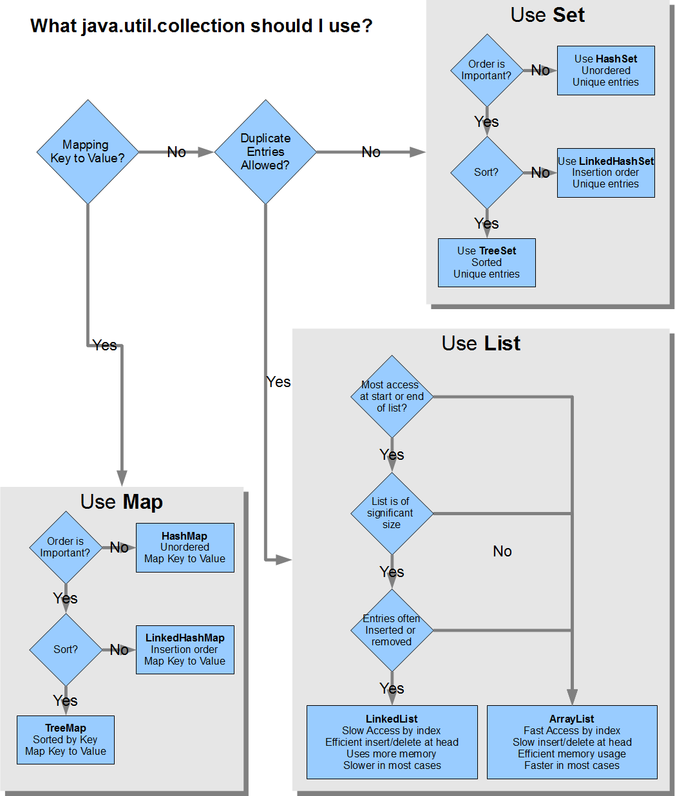

When you are faced with a programming challenge that requires picking a data structure, how do you decide which one to use?

Here is a convenient flowchart to help you with that from [this](https://stackoverflow.com/questions/21974361/which-java-collection-should-i-use) StackOverflow question.

## References

Part of the material has been taken from the following sources. The usage of the referenced copyrighted work is in line with fair use since it is for nonprofit educational purposes.

- https://en.wikipedia.org/wiki/Linked_list#Doubly_linked_list
- https://en.wikipedia.org/wiki/Set_(abstract_data_type)
- http://beginnersbook.com/2013/12/linkedlist-in-java-with-example/
- http://interactivepython.org/courselib/static/pythonds/SortSearch/Hashing.html
- http://javaconceptoftheday.com/how-Hashset-works-internally-in-java/
- http://javahungry.blogspot.com/2013/08/Hashing-how-Hash-map-works-in-java-or.html
- https://www.tutorialspoint.com/data_structures_algorithms/linked_list_algorithms.htm
- https://www.tutorialspoint.com/java/java_collections.htm
- https://www.tutorialspoint.com/java/java_Hashset_class.htm
- http://stackoverflow.com/questions/21974361/what-java-collection-should-i-use
- http://stackoverflow.com/questions/322715/when-to-use-linkedlist-over-arraylist
- http://stackoverflow.com/questions/6100148/collection-interface-vs-arrays
- http://tutorials.jenkov.com/java-collections/index.html
- http://tutorials.jenkov.com/java-generics/index.html
- http://www.developer.com/java/article.php/10922_3829891_2/Selecting-the-Best-Java-Collection-Class-for-Your-Application.htm
- http://www.javamex.com/tutorials/collections/how_to_choose.shtml
- http://www.javapractices.com/topic/TopicAction.do?Id=65
- http://www.javatpoint.com/collections-in-java
- http://www.rapidprogramming.com/questions-answers/java-arrays-and-collections-differences-arrays-vs-collections-1604
- https://docs.oracle.com/javase/tutorial/collections/interfaces/set.html
- http://interactivepython.org/courselib/static/pythonds/SortSearch/Hashing.html
- http://javaconceptoftheday.com/how-Hashset-works-internally-in-java/
- http://javahungry.blogspot.com/2013/08/Hashing-how-Hash-map-works-in-java-or.html
- http://javarevisited.blogspot.it/2011/04/synchronization-in-java-synchronized.html
- http://stackoverflow.com/questions/21974361/what-java-collection-should-i-use
- http://stackoverflow.com/questions/4290132/java-collections-which-collection-to-use-and-when
- http://www.javamex.com/tutorials/collections/how_to_choose.shtml
- http://www.developer.com/java/article.php/10922_3829891_2/Selecting-the-Best-Java-Collection-Class-for-Your-Application.htm

